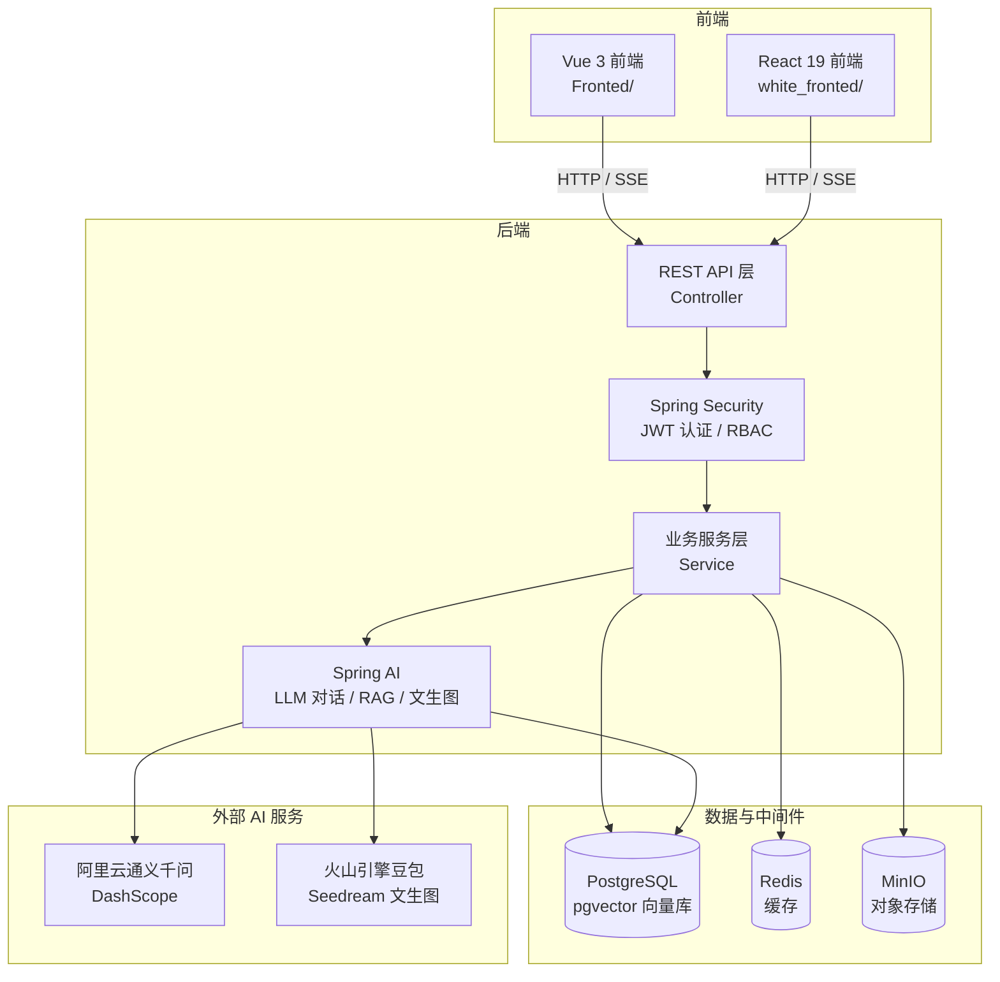

# YoyuEN-Knowledge

> 一个 AI 驱动的个人知识管理与内容创作平台

YoyuEN-Knowledge 是一个集 **AI 智能对话**、**知识库检索增强生成（RAG）**、**内容创作**、**个人生活记录**于一体的综合性知识管理平台。系统以个人知识库为核心，借助大语言模型（LLM）与向量检索技术，帮助用户高效地管理知识、创作内容、记录生活，并提供一个完整的后台管理系统。

---

## 目录

- [项目简介](#项目简介)
- [系统功能](#系统功能)
- [技术栈](#技术栈)
- [系统架构](#系统架构)
- [数据模型](#数据模型)
- [目录结构](#目录结构)
- [环境要求](#环境要求)
- [本地开发启动](#本地开发启动)
  - [1. 启动后端](#1-启动后端)
  - [2. 启动前端](#2-启动前端)
- [Docker 部署](#docker-部署)
- [配置说明](#配置说明)
- [API 文档](#api-文档)

---

## 项目简介

本项目是一个面向个人的知识管理平台，核心目标是解决「个人知识碎片化、内容创作效率低」的问题。系统将传统的内容管理（文章、日记、碎碎念、照片）与前沿的 AI 能力（大模型对话、RAG 知识库问答、AI 文生图）深度结合，提供从知识沉淀到内容创作的完整闭环。

系统包含两大前端实现（Vue 3 与 React 19），共享同一套后端服务，可根据偏好选择其一进行部署。

---

## 系统功能

### 一、前台用户端

| 模块 | 说明 |
|------|------|
| **AI 智能对话** | 支持简单对话、长上下文对话、多模态对话（文本+图片）以及基于知识库的 RAG 对话，流式（SSE）输出 |
| **内容创作** | 文章发布、编辑，支持 Markdown、图片上传、视频链接，AI 自动生成摘要与封面 |
| **内容详情** | Markdown 渲染、图片预览、评论展示、相关文章引用 |
| **时光手札（日记）** | 日记的撰写与展示，时间线回顾 |
| **碎碎念** | 类似「微博/心情」的短内容记录，支持知识库存储 |
| **个人中心** | 个人信息、照片墙、热力图（活跃度）展示 |

### 二、后台管理系统

| 模块 | 说明 |
|------|------|
| **仪表盘** | 数据总览、统计图表、AI 数据助手 |
| **文章管理** | 文章的增删改查、分类与标签管理 |
| **分类 / 标签管理** | 内容分类与标签的维护 |
| **评论管理** | 评论的审核与管理 |
| **图片管理** | 图片的上传、管理、AI 动漫化处理 |
| **知识库管理** | 知识库创建、文档上传、解析与向量化 |
| **日记管理** | 日记的维护 |
| **数据统计** | 文章数量、评论数量等统计数据 |
| **用户 / 角色 / 权限** | 基于 RBAC 的用户权限管理 |

### 三、AI 能力

- **对话能力**：接入阿里云通义千问（`qwen-max` / `qwen3-max`），支持流式输出。
- **RAG 检索增强生成**：文档上传后经 Tika 解析、分块、Embedding 向量化，存入 PostgreSQL 的 `pgvector`，对话时检索相关片段作为上下文，实现「基于个人知识库的问答」。
- **文生图**：接入火山引擎「豆包 Seedream」大模型，支持 AI 生成文章封面、图片动漫化。
- **AI 摘要**：调用 LLM 自动生成文章摘要。
- **仪表盘 AI 助手**：基于数据统计的智能问答。

---

## 技术栈

### 后端

| 技术 | 版本 | 用途 |
|------|------|------|
| Java | 21 | 运行时 |
| Spring Boot | 3.3.5 | 基础框架 |
| Spring Security + JWT | jjwt 0.12.5 | 认证与权限控制（RBAC） |
| Spring AI | 1.0.0-M4 | 统一 AI 抽象（OpenAI 兼容协议） |
| MyBatis-Plus | 3.5.10 | ORM 框架 |
| Spring Data JPA | — | 部分实体持久化 |
| PostgreSQL | 16（pgvector） | 关系数据库 + 向量存储 |
| Redis | 7 | 缓存 / 会话 |
| MinIO | latest | 对象存储（图片、文件） |
| Spring WebFlux | — | SSE 流式输出 |
| Apache Tika / PDFBox / POI | 3.0.0 / 3.0.3 / 5.4.0 | 文档解析（PDF、Word、表格等） |
| Thumbnailator | 0.4.20 | 图片缩略图处理 |
| Knife4j / SpringDoc | 4.5.0 / 2.3.0 | API 文档 |

### 前端（Vue 版 `Fronted/`）

| 技术 | 版本 | 用途 |
|------|------|------|
| Vue | 3.5 | 框架 |
| Vite | 7 | 构建工具 |
| Vue Router | 4 | 路由 |
| Pinia | 3 | 状态管理 |
| Element Plus | 2.13 | UI 组件库 |
| Swiper | 12 | 轮播 / 滑动 |
| GSAP | 3.14 | 动画 |
| marked | 17 | Markdown 渲染 |
| axios | 1.13 | HTTP 请求 |
| vue3-calendar-heatmap | 2.0 | 热力图 |

### 前端（React 版 `white_fronted/`）

| 技术 | 版本 | 用途 |
|------|------|------|
| React | 19 | 框架 |
| TypeScript | ~6.0 | 类型系统 |
| Vite | 8 | 构建工具 |
| Redux Toolkit | 2.12 | 状态管理 |
| React Router | 7 | 路由 |
| Tailwind CSS | 4 | 样式 |
| Radix UI | — | 无头组件库 |
| lucide-react | — | 图标 |
| Swiper / GSAP / marked | — | 交互与渲染 |

### 部署

- **Docker / Docker Compose**：容器化编排（PostgreSQL、Redis、MinIO、后端、前端）
- **Nginx**：前端静态资源托管与反向代理

---

## 系统架构



**核心流程说明：**

1. **RAG 知识库问答流程**：用户上传文档 → 后端使用 Tika 解析文档内容 → 文本分块 → 调用 Embedding 模型（`text-embedding-v4`）向量化 → 存入 `pgvector` → 用户提问时，将问题向量化并在向量库中检索相似片段 → 将检索结果拼入 Prompt → 交由 LLM 生成回答。

2. **认证流程**：用户登录 → 后端校验 → 签发 JWT → 前端存储 Token → 后续请求携带 `Authorization` 头 → Spring Security 过滤器校验。

---

## 数据模型

系统主要数据表（PostgreSQL）如下：

| 表名 | 说明 |
|------|------|
| `chat_conversation` | 对话会话 |
| `chat_message` | 对话消息记录 |
| `content` | 文章 / 内容 |
| `content_tag` / `content_tag_relation` | 标签及内容-标签关联 |
| `comment` | 评论 |
| `diary` | 日记 |
| `murmur` | 碎碎念 |
| `photo` | 照片 |
| `knowledge_base` | 知识库 |
| `document_entity` | 文档实体（知识库文档） |
| `origin_file_source` | 原始文件资源 |
| `user_profile` | 用户个人信息 |
| `system_user` | 系统用户 |
| `system_role` | 系统角色 |
| `system_permission` | 系统权限 |
| `system_user_role` | 用户-角色关联 |
| `system_role_permission` | 角色-权限关联 |
| `vector_store` | 向量存储（pgvector） |

数据库初始化脚本位于 `Backend/sql/`（`init.sql`、`public.sql`、`yoyuen.sql`），Docker 首次启动时会自动执行。

---

## 目录结构

```
YoyuEN-Knowledge/
├── Backend/                    # 后端（Spring Boot）
│   ├── pom.xml                 # Maven 依赖配置
│   ├── mvnw / mvnw.cmd         # Maven Wrapper
│   ├── sql/                    # 数据库初始化脚本
│   └── src/main/
│       ├── java/com/yoyuen/backend/
│       │   ├── controller/     # 控制层
│       │   ├── service/        # 业务层（含 ai 子包）
│       │   ├── mapper/         # MyBatis-Plus Mapper
│       │   ├── entity/         # 实体
│       │   ├── config/         # 配置类
│       │   ├── security/       # 安全认证
│       │   └── utils/          # 工具类
│       └── resources/
│           ├── application.properties  # 主配置
│           ├── llm-dev.properties      # LLM 配置
│           ├── mapper/                 # MyBatis XML
│           └── prompt/                 # 提示词模板
├── Fronted/                    # 前端（Vue 3）
│   ├── src/
│   │   ├── views/              # 页面（含 admin/）
│   │   ├── components/         # 组件
│   │   ├── api/                # API 封装
│   │   ├── router/             # 路由
│   │   ├── stores/             # Pinia 状态
│   │   └── assets/             # 静态资源
│   └── vite.config.js
├── white_fronted/              # 前端（React 19，重构版）
├── docker/                     # Docker 部署配置
│   ├── docker-compose.yml
│   ├── .env                    # 环境变量（含密钥，勿提交）
│   ├── backend/Dockerfile
│   └── fronted/                # 前端镜像与 Nginx 配置
├── Stage/                      # 项目阶段文档
└── README.md
```

---

## 环境要求

- **JDK 21**（后端）
- **Maven 3.8+**（后端构建）
- **Node.js 18+**（前端）
- **PostgreSQL 16 + pgvector 扩展**
- **Redis 7**
- **MinIO**
- （可选）**Docker 与 Docker Compose**（容器化部署）

---

## 本地开发启动

### 1. 启动后端

**前置：** 需先准备好 PostgreSQL（含 pgvector 扩展）、Redis、MinIO，或通过 Docker 单独启动这些中间件。

```bash
cd Backend

# 使用 Maven Wrapper 启动
./mvnw spring-boot:run

# 或使用本地 Maven
mvn spring-boot:run
```

后端默认监听端口 **12138**，Context Path 为 **`/api`**，即接口地址形如 `http://localhost:12138/api/...`。

**配置环境变量**（LLM / 中间件相关，可通过环境变量覆盖 `application.properties` 中的默认值）：

| 环境变量 | 说明 |
|----------|------|
| `DASHSCOPE_API_KEY` | 阿里云通义千问 API Key（必填） |
| `DB_HOST` / `DB_PORT` / `DB_NAME` / `DB_USER` / `DB_PASSWORD` | PostgreSQL 连接信息 |
| `REDIS_HOST` / `REDIS_PORT` / `REDIS_PASSWORD` | Redis 连接信息 |
| `MINIO_ENDPOINT` / `MINIO_ACCESS_KEY` / `MINIO_SECRET_KEY` / `MINIO_BUCKET` | MinIO 连接信息 |
| `VOLCENGINE_ACCESS_KEY` / `VOLCENGINE_SECRET_KEY` | 火山引擎凭证（文生图） |
| `VOLCENGINE_ARK_API_KEY` | 火山引擎 Ark API Key（豆包大模型） |

### 2. 启动前端

**Vue 版：**

```bash
cd Fronted
npm install
npm run dev
```

**React 版：**

```bash
cd white_fronted
npm install
npm run dev
```

前端启动后通过 Vite 默认地址（通常 `http://localhost:5173`）访问。

---

## Docker 部署

项目提供了完整的容器化部署方案，一键启动全部服务。

### 1. 配置环境变量

编辑 `docker/.env`，填入数据库、Redis、MinIO 及各 AI 服务的密钥：

```bash
# 数据库
DB_NAME=know-ai
DB_USER=postgres
DB_PASSWORD=your_password

# Redis
REDIS_PASSWORD=your_password

# MinIO
MINIO_ACCESS_KEY=minioadmin
MINIO_SECRET_KEY=minioadmin
MINIO_BUCKET=default

# AI 服务
DASHSCOPE_API_KEY=your_dashscope_key
VOLCENGINE_ACCESS_KEY=your_volcengine_access_key
VOLCENGINE_SECRET_KEY=your_volcengine_secret_key
VOLCENGINE_ARK_API_KEY=your_ark_key
```

> ⚠️ **安全提示**：`.env` 文件包含敏感密钥，已被 `.gitignore` 忽略，请勿提交到代码仓库。

### 2. 构建并启动

后端需先生成可执行 JAR（`docker/backend/Dockerfile` 会 COPY 该 JAR）：

```bash
# 1. 构建后端 JAR
cd Backend
mvn clean package -DskipTests
# 将生成的 target/Backend-0.0.1-SNAPSHOT.jar 复制到 docker/backend/ 目录

# 2. 启动全部服务
cd ../docker
docker-compose up -d --build
```

启动完成后，服务如下：

| 服务 | 地址 | 说明 |
|------|------|------|
| 前端 | `http://localhost` (80) | Nginx 托管的静态页面 |
| 后端 API | `http://localhost:12138/api` | REST 接口 |
| MinIO 控制台 | `http://localhost:9001` | 对象存储控制台 |
| PostgreSQL | `localhost:5432` | 数据库 |
| Redis | `localhost:6379` | 缓存 |

### 3. 查看日志 / 停止

```bash
docker-compose logs -f backend   # 查看后端日志
docker-compose down              # 停止并移除容器
docker-compose down -v           # 连同数据卷一并删除（慎用）
```

---

## 配置说明

### 后端核心配置（`application.properties`）

- **服务端口**：`server.port=12138`，`server.servlet.context-path=/api`
- **AI 对话**：`spring.ai.openai.*` 配置了通义千问的兼容端点与默认模型（`qwen-max`）
- **向量存储**：`spring.ai.vectorstore.pgvector.*` 配置了 pgvector 的维度（1024）、索引类型（HNSW）与距离度量（余弦距离）
- **安全白名单**：`security.allow-list[]` 定义了无需认证即可访问的接口路径
- **文件上传限制**：`spring.servlet.multipart.*` 支持最大 500MB 上传（视频等大文件）

### LLM 配置（`llm-dev.properties`）

| 配置项 | 默认模型 | 用途 |
|--------|----------|------|
| `chat.simple.*` | `qwen3-max` | 简单对话 |
| `chat.long.*` | `qwen-max` | 长上下文对话 |
| `chat.multimodal.*` | `qwen-multimodal-v1` | 多模态对话 |
| `embedding.*` | `text-embedding-v4` | 向量化（RAG） |

---

## API 文档

系统集成了 Knife4j / SpringDoc，启动后端后可通过以下地址访问接口文档：

- **Swagger UI**：`http://localhost:12138/api/swagger-ui/index.html`
- **Knife4j 文档**：`http://localhost:12138/api/doc.html`

---

## 许可

本项目为个人毕设作品，仅供学习交流使用。
