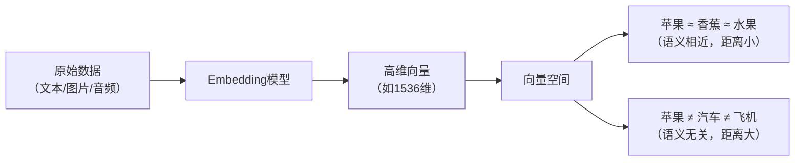
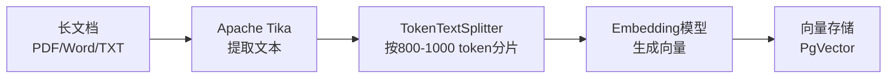
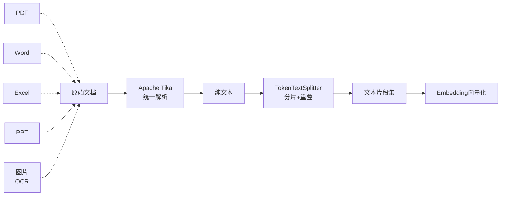
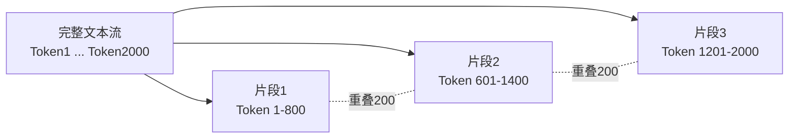
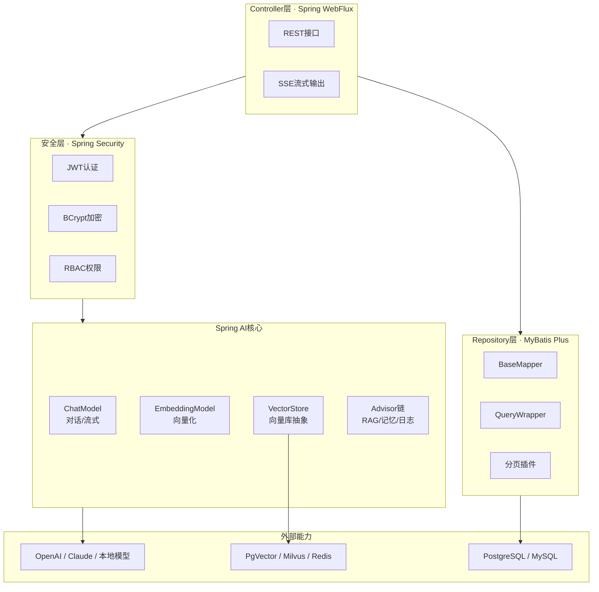
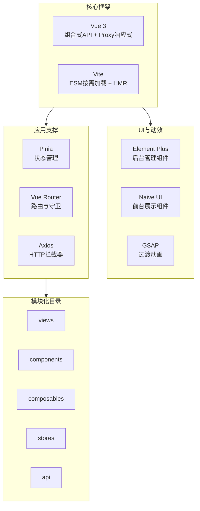
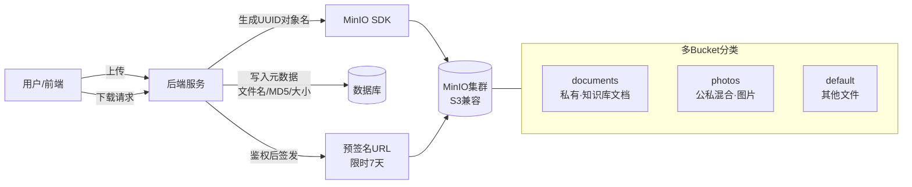
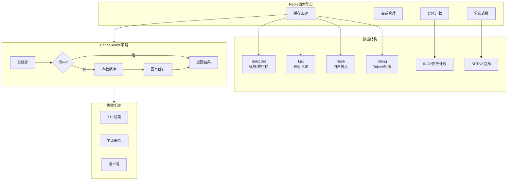

## 第二章 相关技术介绍

### 2.1 检索增强生成技术（RAG）

检索增强生成（Retrieval-Augmented Generation，RAG）是本系统的核心技术，它让AI不再是一个"只会背诵训练数据的书呆子"，而是能够随时查阅"个人档案"的智能助手。如果把传统的大语言模型比作一个接受过通识教育的学生，那么RAG技术就相当于给这位学生配备了一个专属的图书馆，当他遇到问题时，可以先去图书馆查找相关资料，再结合自己的知识给出回答。

在构建个人知识库驱动的AI自我认知系统中，RAG技术解决了两个关键问题。第一个问题是"知识时效性"——大语言模型的训练数据有截止日期，无法了解用户最新上传的文档和想法；第二个问题是"个性化缺失"——通用模型不了解每个用户的独特背景、专业领域和个人偏好。RAG通过动态检索用户知识库中的相关内容，让AI能够基于用户的个人资料进行回答，实现真正的"认识你自己"。

从技术实现角度来看，RAG的工作流程包含四个关键环节。首先是**查询理解**，系统接收到用户问题后，会分析问题意图，判断是否需要检索知识库。例如，当用户问"根据我的笔记，我上周提到的那个项目方案是什么"时，系统识别出需要检索个人笔记内容。其次是**语义检索**，系统将查询语句转换为向量表示，在向量数据库中查找语义相似的文档片段。这个过程不是简单的关键词匹配，而是理解查询的深层含义——即使用户使用的词汇与文档中的词汇不同，系统也能找到相关内容。第三是**上下文构建**，将检索到的多个文档片段按照相关度排序，组织成结构化的上下文。最后是**增强生成**，将用户问题和检索到的上下文一起输入大语言模型，生成结合个人知识库内容的个性化回答。

RAG技术在业界有广泛应用。Notion的AI功能就是一个典型例子，当用户在Notion中提问时，AI会检索用户的工作空间内容来回答。Microsoft 365 Copilot同样采用了类似技术，能够基于用户的邮件、文档和会议记录提供个性化建议。在学术研究领域，RAG被用于构建个性化的研究助手，帮助学者管理海量文献。本系统的RAG实现参考了这些成熟方案，特别针对个人知识库场景进行了优化，包括支持多知识库切换、细粒度的文档片段检索、以及引用溯源功能。

### 2.2 向量嵌入技术（Embedding）

向量嵌入（Embedding）是现代AI系统的基石技术。它的核心思想是将人类世界的文字、图片、音频等各类信息转化为一组保留语义特征的数字向量——语义相近的对象在向量空间中的距离也相近。例如，"苹果"的向量与"水果"、"香蕉"的向量距离较近，而与"汽车"、"飞机"的向量距离较远。这种语义关联并非硬编码，而是模型在海量文本上训练时自动学习到的。向量嵌入的基本原理如图2-1所示。

**图2-1 向量嵌入的基本原理**

在文本领域，主流的Embedding模型各有特点，其对比如表2-1所示。

**表2-1 主流文本Embedding模型对比**

| 模型 | 提供方 | 向量维度 | 特点 | 适用场景 |
|------|--------|----------|------|----------|
| text-embedding-ada-002 | OpenAI | 1536 | 多语言、多领域均衡表现 | 通用场景（本系统选用） |
| BGE（BAAI General Embedding） | 智源研究院 | 768/1024 | 中文语义优化，开源免费 | 中文文本处理 |
| Sentence-BERT | 开源社区 | 768 | 可本地部署，无需联网 | 对数据隐私要求高的场景 |

在本系统中，向量嵌入技术贯穿始终：每个上传的文档、每篇用户写的文章、每条评论都会被转化为向量存储起来，共同构成用户"数字化自我"的数学表示。针对长文档，系统采用"解析—分片—向量化"的分层处理策略，其处理流程如图2-2所示。

**图2-2 长文档向量化处理流程**

该策略既能保留文档的细粒度信息，又能适应大模型的上下文长度限制。向量嵌入的质量直接决定后续检索的效果——若模型不能理解"学习笔记"与"知识总结"属于同义表达，检索时便会漏掉相关内容。基于多语言、多领域的均衡表现以及与后续大模型环节的良好兼容性，本系统最终选用OpenAI的text-embedding-ada-002作为Embedding模型。

### 2.3 向量数据库技术（PgVector）

向量数据库是专门用于存储和检索高维向量的数据库系统，它是个人知识库的"记忆存储器"。如果说向量嵌入是把知识编码成数字，那么向量数据库就是高效管理这些数字档案的仓库。传统的数据库擅长处理结构化数据（如用户名、密码、订单金额），但对于"找出语义相似的文档"这类查询就显得力不从心。向量数据库通过专门的索引结构和相似度计算算法，能够在毫秒级时间内从数百万条向量中找到最相似的结果。

在AI自我认知系统中，向量数据库扮演着"长期记忆库"的角色。用户的所有文档、笔记、评论都被转换为向量后存储在这里，当AI需要"回忆"某个信息时，就通过向量检索快速找到相关内容。这种检索不是精确匹配，而是语义相似度匹配——就像人类回忆往事时，往往不需要精确记得每个字，而是根据模糊的语义线索找到相关记忆。

目前主流的向量数据库有几种选择。**专用向量数据库**如Pinecone、Milvus、Weaviate，专门为向量检索设计，在超大规模数据场景下性能优异。Pinecone是托管服务，无需运维，适合快速上线；Milvus是开源方案，支持分布式部署，适合大规模应用。**扩展型数据库**如PostgreSQL+PgVector、Redis Vector，在现有数据库基础上添加向量功能。PgVector是PostgreSQL的扩展，可以在同一个数据库中管理结构化数据和向量数据，简化了架构。**图数据库**如Neo4j，也支持向量索引，适合需要同时处理关系数据和向量数据的场景。

本系统选择PgVector作为向量存储方案，主要基于以下考虑。首先是**一体化架构**，PgVector作为PostgreSQL扩展，业务数据和向量数据可以在同一个数据库中管理，减少了系统复杂度。其次是**成熟稳定**，PostgreSQL是历经考验的关系型数据库，ACID事务保证、备份恢复、权限管理等功能完善。第三是**SQL接口**，可以使用标准SQL进行向量操作，学习成本低。第四是**成本效益**，无需额外部署专门的向量数据库服务，降低了运维成本。

PgVector支持多种索引算法优化检索性能。**IVFFlat**（倒排文件索引）将向量空间划分为多个聚类，检索时只搜索最近的几个聚类，适合百万级数据量。**HNSW**（分层可导航小世界图）构建多层图结构，通过贪婪搜索在图中快速定位最近邻，检索速度极快，适合千万级以上数据量。**暴力搜索**则直接计算查询向量与所有候选向量的距离，准确率100%但速度慢，适合数据量较小（万级以下）或需要精确结果的场景。本系统在数据量较小时使用暴力搜索保证准确率，随着数据增长可创建HNSW索引提升性能。

从实现细节来看，PgVector的使用非常直观。安装扩展后，可以在表中定义向量类型的列，直接存储高维向量。相似度查询使用特殊的操作符，如`<=>`表示余弦距离，`<->`表示欧氏距离。创建索引使用`CREATE INDEX`语句，指定索引类型和参数。这种与标准SQL的兼容性，让开发者可以快速上手，无需学习全新的查询语言。

### 2.4 文档解析与分割技术

文档解析与分割是知识库建设的"预处理车间"，负责将各种格式的原始文档统一转换为可向量化的文本片段。本系统采用Apache Tika统一解析多格式文档，再通过TokenTextSplitter完成分片处理，整体流程如图2-3所示。

**图2-3 文档解析与分割流程**

Apache Tika采用插件化架构，对各类格式分别调用专用解析器，对外提供统一的API接口，本系统借此支持100余种文件格式。各格式对应的解析方式如表2-2所示。

**表2-2 Apache Tika常见格式解析方式**

| 文件格式 | 底层解析器 | 提取内容 |
|----------|------------|----------|
| PDF | PDFBox | 文本与元数据 |
| Word | Apache POI | 文本、样式 |
| Excel | Apache POI | 单元格数据 |
| PPT | Apache POI | 幻灯片文本 |
| 图片 | Tesseract OCR | 图中文字 |
| 音视频 | 元数据解析器 | 标题、作者等元数据 |

文档分割粒度直接影响向量的表达能力：粒度过大无法准确表征局部语义，过小则丢失上下文。本系统采用TokenTextSplitter按token切分，默认每片段800 token、相邻片段保留200 token重叠区，分片示意如图2-4所示。重叠区可避免句子在分割边界被截断，确保检索时语义完整。

**图2-4 TokenTextSplitter分片与重叠示意**

### 2.5 Spring Boot与Spring AI框架

Spring Boot基于"约定优于配置"理念，承担系统后端基础框架；Spring AI在其之上提供统一的AI抽象，屏蔽不同模型与向量库的差异。本系统后端的整体技术栈与分层结构如图2-5所示。

**图2-5 Spring Boot与Spring AI技术栈**

通过Spring AI的统一抽象，业务代码与具体模型/向量库解耦，切换实现无需改动上层逻辑。

### 2.6 Vue 3前端技术栈

Vue 3采用组合式API与Proxy响应式机制，配合Vite构建、Element Plus / Naive UI组件库、GSAP动画库以及Pinia + Vue Router + Axios三大支撑模块，构成本系统前端技术栈。整体架构如图2-6所示。

**图2-6 Vue 3前端技术栈**

### 2.7 MinIO对象存储技术

MinIO是兼容Amazon S3 API的开源对象存储，本系统通过多Bucket分类管理 + 预签名URL机制实现各类文件的存储与权限控制。文件上传与访问流程及Bucket划分如图2-7所示。

**图2-7 MinIO对象存储架构**

针对图片资源额外采用"原图 + 缩略图"分离策略：上传时自动生成缩略图，列表用缩略图、详情加载原图，以降低带宽消耗。

### 2.8 Redis缓存技术

Redis作为高性能内存数据库，在本系统中承担缓存加速、会话管理、实时计数、分布式锁四类职责。其使用场景与数据结构、缓存策略的对应关系如图2-8所示。

**图2-8 Redis缓存技术体系**
