## 第四章 系统设计

### 4.1 系统架构设计

系统架构设计是在需求分析的基础上，从技术实现层面对系统进行宏观规划的过程。一个合理的架构既要让各模块的职责清清楚楚、互不干扰，又要让整体具备足够的可扩展性与可维护性，能跟得上业务的自然演化。本节从逻辑架构、技术框架与部署架构三个维度对本系统进行整体设计：逻辑架构采用经典的五层分层模型，把"用户看到什么、后端怎么响应、业务怎么编排、数据怎么读写、数据最终存到哪里"这几件事彻底分开；技术框架围绕Spring Boot与Vue 3两大主流技术栈组织，配合Spring AI、PgVector、MinIO等特定能力组件共同构建；部署架构则基于Docker容器化与云服务器，通过Docker Compose实现各服务的一键编排与隔离运行，为系统的持续运行与后续扩容提供支撑。

#### 4.1.1 系统整体架构

本系统在宏观上采用经典的五层分层架构（Layered Architecture），自上而下依次为表现层、应用层、逻辑层、数据层与持久层。这种结构的核心思想是"单向依赖"：每一层只调用其下一层提供的接口，层与层之间通过定义良好的协议通信，上层无需关心下层的具体实现，下层也不反向感知上层的业务逻辑。这样做带来的好处是任一层的内部调整都可以被限制在本层范围内完成，不会牵连出跨层级的大规模改造，也为后续替换某一类技术（如更换向量数据库、引入新的缓存中间件）留足了腾挪空间。系统整体架构如图4-1所示。

```
┌──────────────────────────────────────────────────────────────────┐
│                     ● 表 现 层 (Presentation Layer)              │
│ ┌────────────────────────────┐  ┌────────────────────────────┐  │
│ │  普通用户前台  (Vue 3)       │  │  管理员后台  (Vue 3)         │  │
│ │ 首页/内容详情/AI问答/评论    │  │ 内容管理/知识库/评论审核     │  │
│ └────────────────────────────┘  └────────────────────────────┘  │
│               Vue Router · Pinia · Axios · EventSource           │  
└───────────────────────────────────│──────────────────────────────┘
                                    │ HTTP / SSE (JSON)
                                    ▼
┌──────────────────────────────────────────────────────────────────┐
│                     ● 应 用 层 (Application Layer)               │
│ ┌─────────────────────────────────────────────────────────────┐ │
│ │   Spring Boot REST Controller + SSE Controller              │ │
│ │  参数校验 / 全局异常处理 / 统一响应封装 / JWT过滤链          │ │
│ └─────────────────────────────────────────────────────────────┘ │
└───────────────────────────────────│──────────────────────────────┘
                                    │ 方法调用
                                    ▼
┌──────────────────────────────────────────────────────────────────┐
│                     ● 逻 辑 层 (Business Logic Layer)            │
│ ┌──────────────┐ ┌──────────────┐ ┌──────────────┐ ┌──────────┐ │
│ │AIChatService │ │KnowledgeBase │ │ContentService│ │Comment   │ │
│ │ RAG流程编排  │ │ Service      │ │ 内容同步     │ │Service   │ │
│ └──────────────┘ └──────────────┘ └──────────────┘ └──────────┘ │
│ ┌──────────────┐ ┌──────────────┐ ┌──────────────────────────┐ │
│ │ UserService  │ │ Dashboard    │ │ 文档解析 / 切分 / 向量化   │ │
│ │ JWT / 权限   │ │ Service      │ │ (Tika · TokenSplitter)   │ │
│ └──────────────┘ └──────────────┘ └──────────────────────────┘ │
└───────────────────────────────────│──────────────────────────────┘
                                    │ 数据访问接口
                                    ▼
┌──────────────────────────────────────────────────────────────────┐
│                     ● 数 据 层 (Data Access Layer)               │
│ ┌──────────────┐ ┌──────────────┐ ┌──────────────┐ ┌──────────┐ │
│ │ MyBatis Plus │ │ Spring AI    │ │ Redis        │ │ MinIO    │ │
│ │   Mapper     │ │ VectorStore  │ │  Template    │ │  Client  │ │
│ └──────────────┘ └──────────────┘ └──────────────┘ └──────────┘ │
└───────────────────────────────────│──────────────────────────────┘
                                    │ 连接 / 驱动
                                    ▼
┌──────────────────────────────────────────────────────────────────┐
│                     ● 持 久 层 (Persistence Layer)               │
│ ┌──────────────┐ ┌──────────────┐ ┌──────────────┐ ┌──────────┐ │
│ │ PostgreSQL   │ │  PgVector    │ │   Redis      │ │  MinIO   │ │
│ │  业务数据    │ │  向量数据    │ │   缓存       │ │ 对象存储 │ │
│ └──────────────┘ └──────────────┘ └──────────────┘ └──────────┘ │
│ ┌──────────────────────────────────────────────────────────────┐│
│ │        外部服务：OpenAI 兼容 LLM / Embedding 模型             ││
│ └──────────────────────────────────────────────────────────────┘│
└──────────────────────────────────────────────────────────────────┘
```

**图4-1 系统整体架构图**

表现层是用户与系统交互的直接界面，由Vue 3构建的单页应用承担，分为面向普通读者的前台和面向博主的后台两个子应用。前台提供内容浏览、AI问答与评论互动等核心体验，后台提供内容发布、知识库维护、评论审核与数据统计等运营功能。该层通过Axios与后端进行HTTP通信，通过EventSource处理AI回答的SSE流式输出，所有交互数据以JSON格式传输。

应用层作为前后端的连接枢纽，由Spring Boot的REST Controller与SSE Controller组成，承担请求接入、参数校验、权限拦截、全局异常处理与响应封装等横切职责。该层的职责刻意保持"薄"：不写任何业务逻辑，只做协议适配与调用转发，真正的业务处理委托给逻辑层完成。这种约束让Controller始终保持易读、易测试的状态。

逻辑层是整个系统的核心，由按业务领域划分的多个Service组件构成，每个组件聚焦于一个业务闭环。AIChatService负责RAG问答流程的编排与大模型调用，KnowledgeBaseService负责知识库的维护与文档向量化任务的调度，ContentService与CommentService负责内容与评论的业务规则处理及知识库同步，UserService负责认证与权限控制，DashboardService负责运营数据汇总与AI运营报告生成。服务之间以接口相互依赖，尽量保持松耦合。

数据层是业务代码与数据存储之间的适配层，屏蔽了具体存储引擎的差异。该层包含四类组件：MyBatis Plus Mapper用于访问PostgreSQL中的业务数据，Spring AI VectorStore用于读写PgVector中的向量数据，Redis Template用于操作Redis缓存，MinIO Client用于上传和下载对象存储中的文件。上层逻辑层只需调用这些统一接口，不必关心底层协议细节。

持久层是系统最终的数据存放处，由PostgreSQL（含PgVector扩展）、Redis与MinIO三类存储，以及外部大语言模型服务共同组成。PostgreSQL承担业务数据与向量数据的双重职责，借助PgVector扩展让这两类数据在同一套事务与备份机制下共存；Redis提供热点数据缓存与会话加速；MinIO以多桶策略托管文档、图片、视频等非结构化文件；外部LLM服务则通过OpenAI兼容接口被调用以完成推理与文本嵌入。

#### 4.1.2 技术框架选型

为在开发效率与运行性能之间取得平衡，系统在各个层次均选用当前社区最为成熟、生态最为完善的技术框架。前端以Vue 3生态为核心，配合Vite构建工具与Element Plus组件库；后端以Spring Boot 3为骨架，结合Spring Security、Spring AI、MyBatis Plus等面向特定能力的扩展框架；数据层使用PostgreSQL搭配PgVector实现业务数据与向量数据的统一管理；基础设施层引入Redis缓存与MinIO对象存储，形成多形态数据的分工存储。系统所采用的核心技术框架及其在各层中的角色如图4-2所示。

```
┌────────┬─────────────────────────────────────────────────────────┐
│ 表现层 │ Vue 3  +  Vue Router  +  Pinia  +  Element Plus  + Vite │
│        │ Axios (HTTP) + EventSource (SSE) + Markdown 渲染器        │
├────────┼─────────────────────────────────────────────────────────┤
│ 应用层 │ Spring Boot 3.3.5  +  Spring MVC  +  Spring WebFlux(SSE) │
│        │ Spring Security 6  +  JWT  +  BCrypt  +  全局异常拦截器  │
├────────┼─────────────────────────────────────────────────────────┤
│ 逻辑层 │ Spring AI  +  LangChain4j 能力集成                       │
│        │ Apache Tika (解析) + TokenTextSplitter (切分) + @Async   │
│        │ 业务服务组件 (AIChat / KnowledgeBase / Content / ... )  │
├────────┼─────────────────────────────────────────────────────────┤
│ 数据层 │ MyBatis Plus (业务)  +  Spring AI VectorStore (向量)    │
│        │ Spring Data Redis (缓存)  +  MinIO Java SDK (对象存储)  │
├────────┼─────────────────────────────────────────────────────────┤
│ 持久层 │ PostgreSQL 16  +  PgVector 扩展 (业务数据 + 向量数据)   │
│        │ Redis 7 + MinIO + 外部 OpenAI 兼容 LLM / Embedding 服务 │
└────────┴─────────────────────────────────────────────────────────┘
```

**图4-2 系统技术框架图**

在表现层，选择Vue 3是因其基于Composition API的组件组织方式更契合复杂单页应用的开发需求，配合Vite的热更新能力可大幅提升前端开发效率；Pinia作为Vue 3官方推荐的状态管理库，替代了旧版Vuex的复杂样板代码；Element Plus则提供了风格统一的企业级UI组件，支撑后台管理界面的快速搭建。

在后端核心，Spring Boot 3.3.5基于JDK 17 LTS构建，是目前Java生态最主流的企业级开发框架，其自动配置机制与Starter依赖体系使项目可以专注于业务代码编写。Spring Security 6提供了开箱即用的安全能力，配合JWT与BCrypt即可快速实现无状态认证。Spring AI是Spring官方推出的AI能力集成框架，通过统一的抽象让各类LLM、Embedding模型与向量数据库可以无缝切换，是本系统RAG功能能够快速落地的关键。

在数据访问与持久化方面，MyBatis Plus通过条件构造器与通用Mapper减少了大量样板SQL；PgVector作为PostgreSQL的官方向量扩展，让向量数据与业务数据共享同一套事务与备份机制，降低了运维复杂度；Redis承担热点数据缓存；MinIO提供S3兼容的对象存储能力，功能上足以替代云厂商的OSS服务。外部LLM服务以OpenAI兼容接口抽象，兼容市面上绝大多数大模型服务商，便于未来根据成本与效果灵活切换模型。

#### 4.1.3 基于Docker的部署架构

系统计划部署于云服务器，并采用Docker容器化方案实现环境隔离与一键部署。相比传统的"手动装JDK、装数据库、改配置文件"的部署方式，Docker的优势主要体现在三点：第一，每个服务运行在独立容器中，彼此之间通过虚拟网络隔离，避免依赖版本冲突；第二，镜像一次构建、处处运行，使得开发环境与生产环境保持一致，从根源上规避了"本地跑得好、上线就崩"的问题；第三，通过Docker Compose编排文件即可定义整套服务的启动顺序与依赖关系，实现一键拉起与一键下线，极大降低了运维门槛。系统的部署架构如图4-3所示。

```
                      ┌─────────────────────────┐
                      │    公网用户浏览器访问    │
                      └────────────┬────────────┘
                                   │  HTTPS (443)
                                   ▼
╔══════════════════════════════════════════════════════════════════╗
║                          云  服  务  器                           ║
║ ┌──────────────────────────────────────────────────────────────┐ ║
║ │                Nginx  反 向 代 理 容 器                       │ ║
║ │        ( HTTPS 卸载 / 静态资源分发 / /api 转发 )             │ ║
║ └────────────────┬───────────────────────────┬─────────────────┘ ║
║                  │ /                         │ /api/*           ║
║                  ▼                           ▼                   ║
║ ┌─────────────────────────┐   ┌────────────────────────────┐   ║
║ │  前端容器  (frontend)    │   │  后端容器  (backend)        │   ║
║ │  Nginx + Vue 静态文件    │   │  Spring Boot Jar           │   ║
║ │  :80 (internal)         │   │  :8080 (internal)          │   ║
║ └─────────────────────────┘   └───┬────────┬────────┬───────┘   ║
║                                    │        │        │           ║
║         ┌──────────────────────────┘        │        └──────┐    ║
║         ▼                                   ▼               ▼    ║
║ ┌──────────────────┐   ┌──────────────────┐   ┌──────────────┐  ║
║ │ PostgreSQL 容器  │   │   Redis  容器    │   │  MinIO 容器  │  ║
║ │  + PgVector 扩展 │   │   缓存服务       │   │  对象存储    │  ║
║ │ Volume: pg_data  │   │ Volume: rds_data │   │ Volume: minio│  ║
║ └──────────────────┘   └──────────────────┘   └──────────────┘  ║
║ ══════════════  均 由 Docker Compose 统 一 编 排  ══════════════ ║
╚══════════════════════════════════│═══════════════════════════════╝
                                   │  HTTPS
                                   ▼
                    ┌────────────────────────────────┐
                    │   外部 OpenAI 兼容 LLM 服务     │
                    │    (LLM 推理 + Embedding)       │
                    └────────────────────────────────┘
```

**图4-3 基于Docker的部署架构图**

部署环境主要由七个容器组成：Nginx反向代理容器负责HTTPS证书卸载、静态资源分发与API反向转发，将前端页面请求与后端API请求路由到对应的内部容器；前端容器内部再次使用Nginx托管Vue构建产物；后端容器运行由构建过程生成的Spring Boot Jar包，提供所有REST与SSE接口；PostgreSQL容器启用了PgVector扩展，同时承担业务数据与向量数据的持久化；Redis与MinIO容器分别提供缓存服务与对象存储服务。为保证数据在容器重启或升级时不丢失，PostgreSQL、Redis与MinIO均挂载了宿主机的持久化卷（Volume），容器本身保持无状态、可随时重建。

在网络配置方面，Docker Compose默认会创建一个内部网络，所有容器通过服务名而非IP进行相互访问——后端容器直接通过`postgresql:5432`、`redis:6379`、`minio:9000`这样的域名连上对应服务。这种基于服务发现的机制既避免了硬编码IP带来的部署脆弱性，又降低了服务间网络配置的复杂度。对外仅暴露Nginx反向代理的443端口，其余容器的端口均只在内部网络可见，从网络层面收敛了攻击面。外部LLM服务通过公网HTTPS接口被后端容器调用，不纳入本系统的部署范围，其稳定性由服务商侧保障。

这种容器化部署方案还为系统后续的扩展铺好了路：当业务流量增长时，可以通过修改Compose文件的replicas配置对无状态的后端容器进行水平扩容，再借助Nginx做简单的负载均衡；当需要迁移到其他云厂商或本地机房时，只需把镜像推送到目标环境的镜像仓库并运行同一份Compose文件即可，无需重新配置运行环境。

### 4.4 模块详细设计

本节对系统各核心模块进行详细设计，分别从类图和顺序图两个维度加以刻画：类图反映模块内部的静态结构与对象协作关系，体现模块的类划分、职责分配与依赖关系；顺序图则刻画模块在典型业务场景下对象之间的动态消息流转，反映模块运行时的调用顺序与交互逻辑。两者结合可完整呈现模块的静态结构与动态行为，为编码实现提供直接依据。

#### 4.4.1 AI服务模块详细设计

##### 4.4.1.1 AI服务模块类图

AI服务模块是系统实现智能问答功能的核心模块，其类图设计采用了接口-实现分离和依赖注入的设计模式，以支持多种对话模式的灵活扩展。该模块对外提供的核心契约为AIChatService接口，它定义了系统所有AI交互能力，包括普通对话（simpleChat）、多模态对话（multimodalChat）、基于知识库的RAG问答（simpleRAGChat / multimodalRAGChat）以及统一路由入口（unifyChat）。通过接口抽象，业务层代码依赖于抽象而非具体实现，便于后续替换或扩展AI服务实现。

AIChatServiceImpl作为AIChatService的具体实现类，通过构造注入的方式聚合了LLMService、OriginFileResourceService、DatabaseChatMemory、ContentService、CommentService等多个协作组件，以及DocumentEntityMapper、KnowledgeBaseMapper两个数据访问接口，共同完成简单对话、多模态对话、RAG检索增强和带引用来源的问答等复杂业务流程。RAG Prompt模板以Spring Resource的形式通过ragPromptResource字段注入，从而实现了提示词与代码的解耦。LLMService同样抽象为接口形态，由LLMServiceImpl统一封装了对简单对话模型、长上下文模型、多模态模型、Embedding模型以及PgVector向量数据库的创建与管理逻辑，供上层业务按需获取，避免了模型客户端创建逻辑在多处重复。

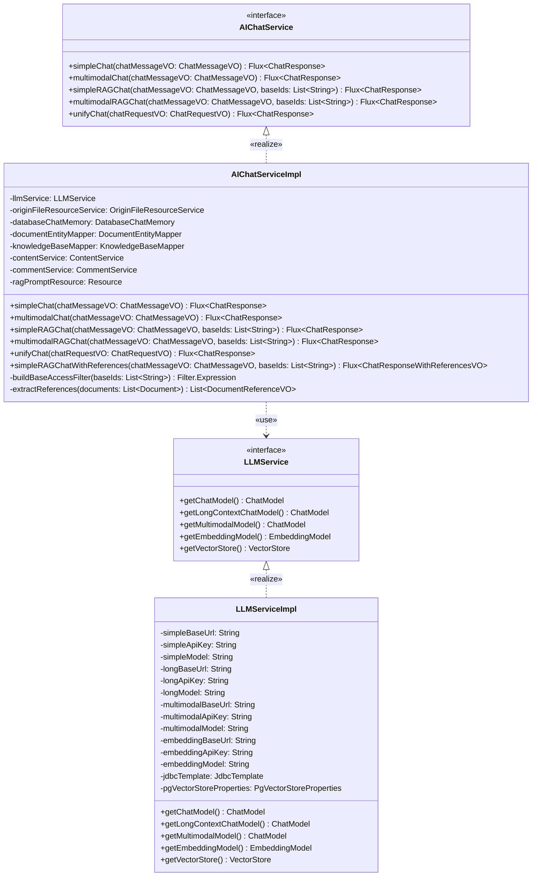

**图4-4 AI服务模块UML类图**

##### 4.4.1.2 AI服务模块顺序图

AI服务模块最具代表性的业务场景为"基于知识库的RAG问答"流程，该流程涉及前端、Controller、AIChatService、向量存储、大模型和聊天记忆组件之间的多次协作。用户在前端发起带知识库的AI提问后，请求先到达ChatController进入unifyChat统一入口；服务层根据请求参数路由到simpleRAGChatWithReferences方法，首先通过DatabaseChatMemory加载历史会话上下文以保证多轮对话的连贯性，然后将用户问题经LLMService提供的EmbeddingModel向量化，并在PgVector向量库中按baseId过滤表达式检索Top-K相似文档，紧接着使用ragPromptResource模板拼装出包含历史消息、检索上下文与用户问题的完整Prompt，调用大模型生成流式回答，同时将检索到的文档元数据提取为引用来源返回前端，AI回答通过Server-Sent Events（SSE）逐字推送给用户。消息持久化由DatabaseChatMemory在流式结束后异步完成。AI服务模块RAG问答流程的顺序图如图4-5所示。

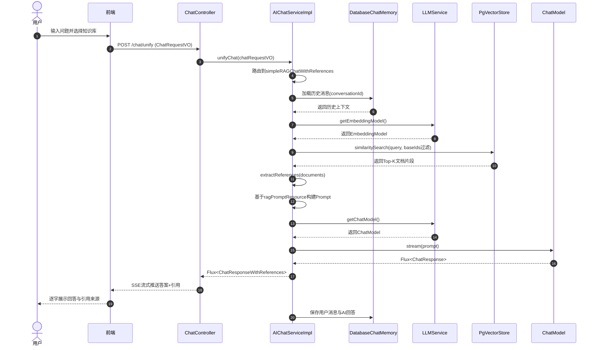

**图4-5 AI服务模块RAG问答顺序图**

#### 4.4.2 知识库管理模块详细设计

##### 4.4.2.1 知识库管理模块类图

知识库管理模块负责个人知识库的创建、文档上传、向量化处理等核心功能，其类图设计体现了领域驱动设计中的实体关系建模思想。该模块包含三个核心领域实体：KnowledgeBase（知识库）、DocumentEntity（文档实体）与OriginFileResource（原始文件资源），以及配套的三个服务接口KnowledgeBaseService、DocumentEntityService与OriginFileResourceService。三个实体类均继承自统一的BaseEntity基类，由基类统一提供createTime、updateTime、deleted等审计字段及逻辑删除字段，避免各实体重复声明相同的基础字段。

KnowledgeBase类表示一个知识库，仅包含id、name、description三个业务字段。一个知识库可以包含多个文档，与DocumentEntity之间通过baseId外键建立聚合关系。DocumentEntity类表示上传到知识库中的文档，通过isEmbedding字段追踪文档是否已完成向量化处理，通过resourceId字段与底层OriginFileResource建立一对一的引用关系。OriginFileResource类则额外实现了StorageFile接口，用于对接统一的对象存储抽象，封装了文件在MinIO对象存储中的完整信息，包括bucketName（存储桶）、objectName（对象名）、contentType（类型）、size（大小）、md5（校验值）以及images（图片列表）等属性。这种将业务实体与存储细节分离的设计，使得上层文档实体无需关心底层存储介质，便于后续更换存储方案。

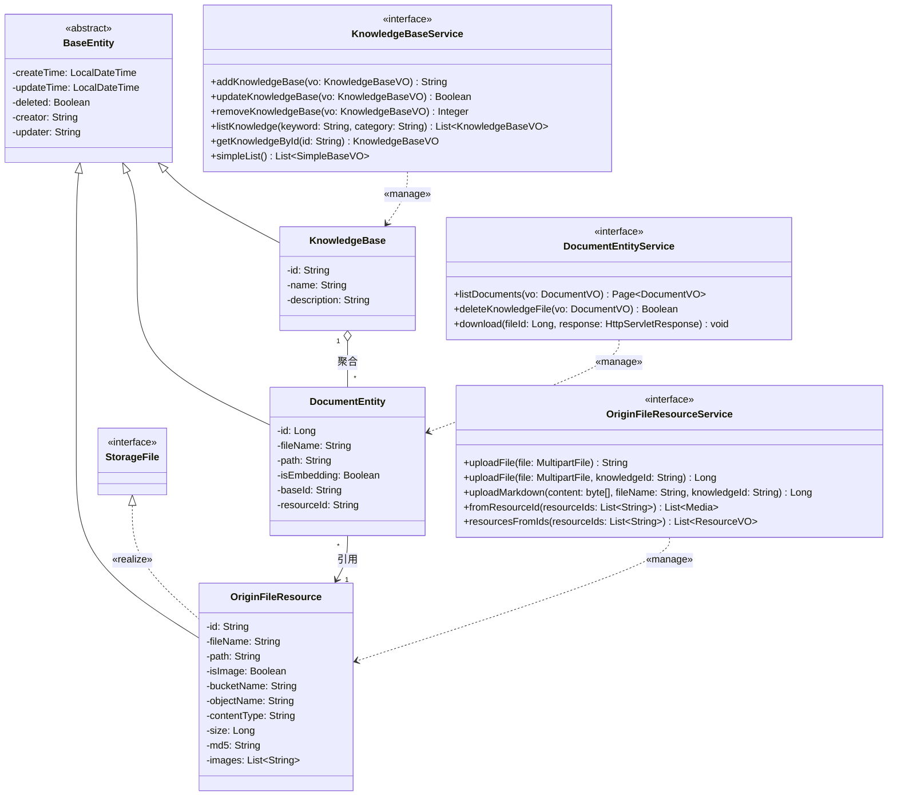

**图4-6 知识库管理模块UML类图**

##### 4.4.2.2 知识库管理模块顺序图

知识库管理模块的典型场景为"文档上传与异步向量化"流程，涉及文件存储、文档解析、分片与向量化多个环节。管理员在前端选择目标知识库并上传文档后，请求先由DocumentController接收，调用OriginFileResourceService将文件持久化到MinIO对象存储并写入origin_file_source表，随后在document_entity表中登记一条is_embedding=false的文档记录同步返回前端，避免阻塞用户等待。随后后台异步线程基于resourceId从MinIO下载文件，使用Apache Tika完成解析，将提取的文本通过TokenTextSplitter按800 token切分并保留200 token重叠，再批量调用EmbeddingModel生成1536维向量并写入PgVector向量库；全部分片处理成功后将document_entity.is_embedding更新为true，用户在前端刷新后即可看到文档进入"已就绪"状态。文档上传流程的顺序图如图4-7所示。

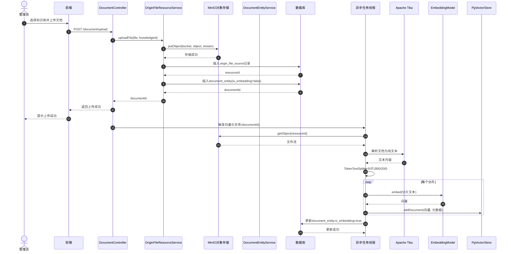

**图4-7 知识库文档上传与向量化顺序图**

#### 4.4.3 内容管理模块详细设计

##### 4.4.3.1 内容管理模块类图

内容管理模块是博客系统的核心，负责文章、视频等内容的发布、展示和互动。该模块的类图设计围绕Content（内容）与Comment（评论）两个核心领域实体展开，对应的业务能力由ContentService、CommentService两个服务接口对外暴露，体现了内容发布与评论互动的业务关系。与知识库模块一样，Content和Comment实体均继承自BaseEntity，由基类统一承载审计与逻辑删除字段。

Content类是内容管理的核心实体，采用统一的领域模型来支持多种内容类型（文章、游戏、学习资源、视频）。类中包含内容的基本属性如title（标题）、description（描述）、content（正文）、category（分类）、cover（封面）等，同时还维护了viewCount（浏览量）和commentCount（评论数）两个冗余统计字段以避免每次展示时的聚合查询；isRecommend字段用于标识内容是否在首页推荐展示；contentType区分内容大类，对于视频类内容额外维护了videoType、videoUrl和videoDuration三个专属字段。浏览量和评论数的原子更新由ContentService的incrementViewCount、incrementCommentCount、decrementCommentCount方法提供，这些写操作被收敛到服务层而非暴露在实体中，符合贫血领域模型下的职责划分。Content与Comment之间是一对多的聚合关系。Comment类代表用户评论，包含content（内容）、author（作者）、avatar（头像）、userId（发表用户）等字段，parentId字段支持评论的嵌套回复功能，replies字段在服务层装配时承载子评论树形结构，isRecommend字段标识是否为推荐评论。

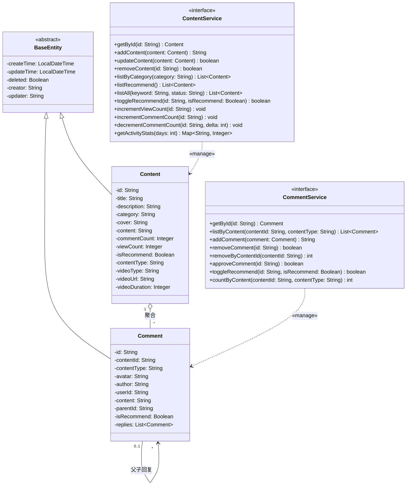

**图4-8 内容管理模块UML类图**

##### 4.4.3.2 内容管理模块顺序图

内容管理模块的代表性场景为"发布内容并同步至知识库"流程。管理员在后台编辑器中填写标题、正文（Markdown）、分类、封面等字段后点击发布，请求先由ContentController接收，经ContentService完成参数校验与实体构造后写入content表；发布成功后，服务层同步触发"知识库化"流程，将内容文本转换为Markdown字节流并调用OriginFileResourceService.uploadMarkdown方法将其作为一条特殊文档上传到指定的"博客内容"知识库，随后复用知识库模块的向量化能力完成异步Embedding。最后Controller将保存结果与contentId返回前端展示。内容发布流程的顺序图如图4-9所示。

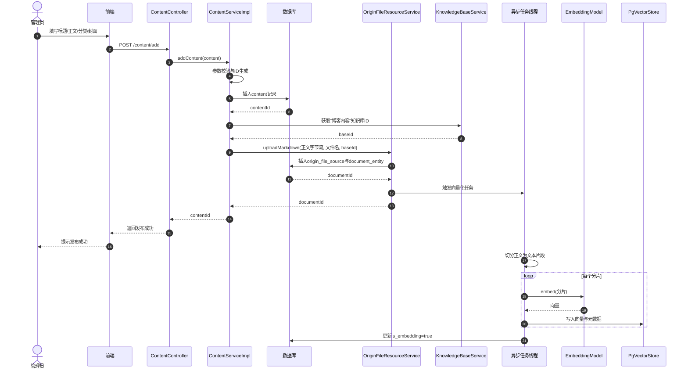

**图4-9 内容发布与知识库同步顺序图**

#### 4.4.4 后台登录模块详细设计

##### 4.4.4.1 后台登录模块类图

用户认证模块基于Spring Security框架实现，采用RBAC（Role-Based Access Control）权限模型设计。该模块的类图涵盖用户实体体系、角色-权限关系以及认证流程所需的JwtService、UserDetailsServiceImpl等支撑组件，通过抽象类/接口实现、关联类等UML关系构建出完整的安全认证体系结构。

SystemUser被设计为抽象类，继承自BaseEntity并实现了Spring Security规定的UserDetails契约，持有用户的核心属性如username、password、avatar以及预装配好的roles与permissions两个集合。之所以设计为抽象类，是为了允许不同用户类型（例如前台用户和后台用户）通过派生出SystemUserImpl等具体子类来扩展差异化字段，同时继续复用UserDetails接口方法的统一实现。SystemUser与SystemRole之间的多对多关联由SystemUserRole这一关联类（Association Class）显式建模，对应数据库的用户-角色中间表，包含userId、roleId两个外键字段。SystemRole与SystemPermission之间同样是多对多关联，维护角色到权限的授权关系。SystemPermission类代表系统中的具体权限（如content:create、comment:delete等细粒度权限）。

除实体外，模块还包含认证辅助组件：UserDetailsServiceImpl实现Spring Security的UserDetailsService接口，通过SystemUserMapper加载数据库中的用户及其角色权限；JwtService则被设计为接口，由JwtServiceImpl负责Token的签发、校验、刷新和过期检测等能力，供JWT过滤器与登录接口调用。这种"实体 + 认证服务"的双层设计既沿用了Spring Security的标准扩展点，又将JWT相关的业务逻辑收敛到专用接口中，便于单元测试与后续替换。

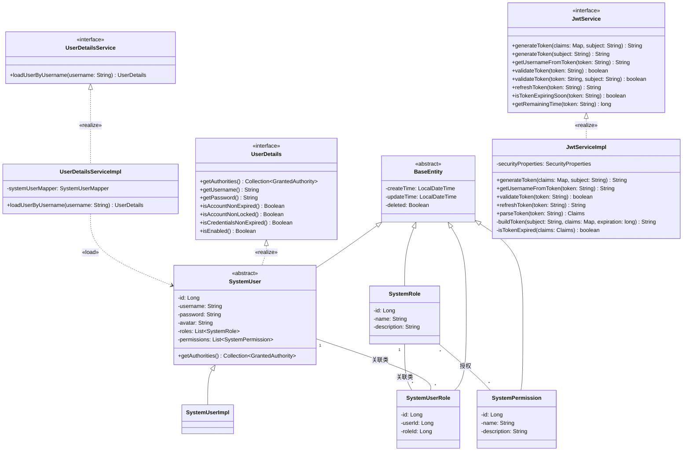

**图4-10 后台登录模块UML类图**

##### 4.4.4.2 后台登录模块顺序图

后台登录模块的典型场景为"管理员登录并访问受保护接口"流程。管理员在后台登录页输入用户名与密码提交后，请求经AuthController交由Spring Security的AuthenticationManager执行认证；AuthenticationManager委托UserDetailsServiceImpl从数据库加载SystemUser并校验BCrypt密码，认证通过后由JwtService签发JWT Token返回前端。前端在后续请求中将Token写入Authorization头；每次请求经JwtAuthenticationFilter拦截，先调用JwtService.validateToken进行签名与过期校验，校验通过后将用户身份写入SecurityContext，再由Spring Security完成权限判断后放行至业务Controller。后台登录与鉴权流程的顺序图如图4-11所示。

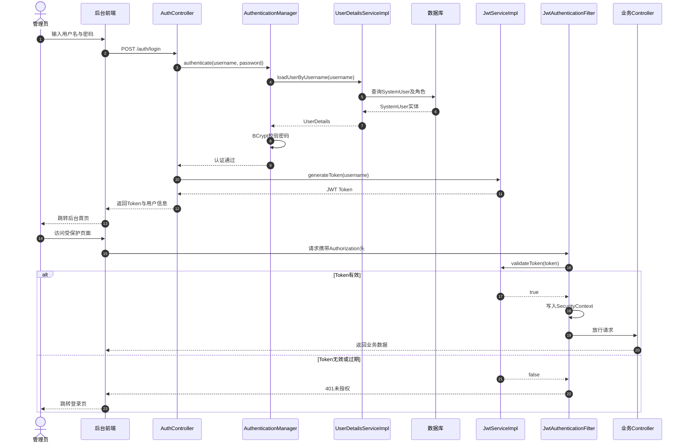

**图4-11 后台登录与鉴权顺序图**

#### 4.4.5 对话管理模块详细设计

##### 4.4.5.1 对话管理模块类图

对话管理模块负责AI问答会话的创建、消息存储和历史记录管理。该模块的类图由两类核心实体（ChatConversation、ChatMessage）与两个对应的服务接口（ChatConversationService、ChatMessageService）组成，整体采用"会话-消息"二级聚合结构，与即时通讯应用的会话模型类似，能够有效地组织和管理用户与AI的多轮对话。两个实体同样继承自BaseEntity，统一获得审计与逻辑删除字段。

ChatConversation类代表一次对话会话，类似于聊天窗口的概念。其业务字段包含id（会话ID）、title（会话标题，通常由第一条用户消息自动生成）、userId（发起用户）以及knowledgeBaseId（关联的知识库ID，可选，用于区分纯对话与基于知识库的RAG问答）。ChatMessage类代表会话中的单条消息，除conversationId、messageNo（消息序号）、content（内容）、role（角色，user或assistant）之外，还通过hasMedia、resourceIds两个字段支持多模态消息（如图片问答），isClean字段用于标记消息是否已被清理（软删除语义）。会话与消息之间采用组合关系，一旦会话被删除其下所有消息也随之删除，因此用UML中的组合关系（filled diamond）表示。

服务层方面，ChatConversationService继承了MyBatis-Plus的IService<ChatConversation>泛型接口，在其基础上扩展了业务方法如getConversation、createConversation、listConversation、listConversationsByKnowledgeBase、removeConversation等；ChatConversationServiceImpl除实现上述方法外，还提供了从实体到VO的批量转换辅助方法。ChatMessageService则侧重于消息格式在数据库实体（ChatMessage）与Spring AI的Message对象之间的双向转换，通过toMessage、fromMessage两个方法将存储模型与AI模型解耦。

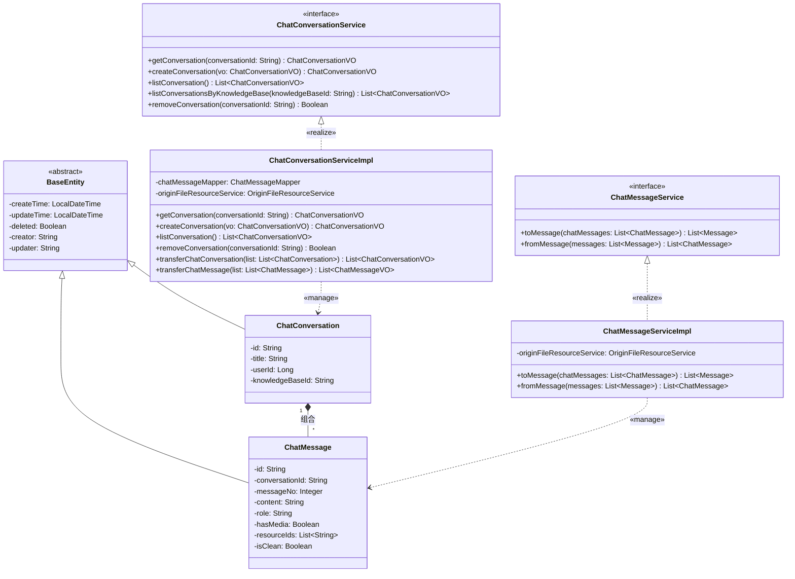

**图4-12 对话管理模块UML类图**

##### 4.4.5.2 对话管理模块顺序图

对话管理模块的典型场景为"创建新会话并发送消息"流程。用户在前台点击"新建对话"后，请求由ChatConversationController接收并委派ChatConversationServiceImpl创建一条新的ChatConversation记录（标题可由首条用户消息自动摘要生成），返回会话ID；用户随后发送第一条消息，AIChatService在流式返回AI答案的同时，由ChatMessageServiceImpl将用户消息与AI消息分别封装为ChatMessage实体，通过fromMessage完成Spring AI Message到存储模型的转换，按messageNo递增顺序写入chat_message表；当用户再次进入该会话时，前端通过会话ID拉取历史消息，服务层使用toMessage将存储实体转换回Spring AI Message结构供模型上下文使用。对话管理流程的顺序图如图4-13所示。

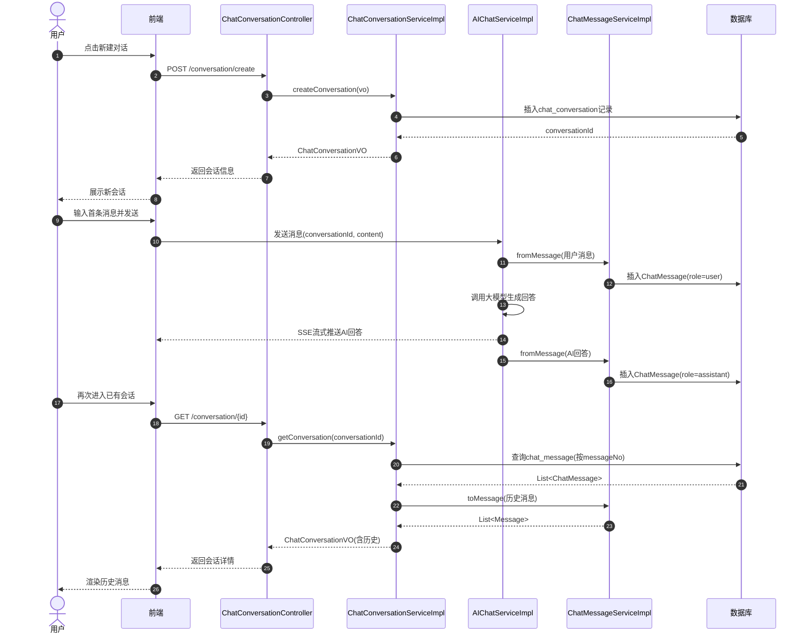

**图4-13 对话管理模块顺序图**

### 4.5 接口设计

系统的接口设计遵循RESTful API规范，采用HTTP协议进行通信，请求和响应数据格式统一使用JSON。接口按照功能模块进行划分，包括AI问答接口、知识库管理接口、内容管理接口和评论接口四大类。所有接口都支持跨域访问（CORS），并采用JWT Token进行身份认证，请求头中需要携带Authorization: Bearer <token>。响应格式统一封装，包含code（状态码）、message（提示信息）和data（业务数据）三个字段，便于前端统一处理。

#### 4.5.1 AI问答接口

AI问答接口是系统的核心接口，提供与AI进行智能对话的能力。该接口支持简单对话和RAG知识问答两种模式，都采用Server-Sent Events（SSE）流式返回方式，实现AI回答的逐字显示效果，提升用户体验。简单对话模式直接调用大语言模型进行通用问答，无需知识库支持；RAG问答模式则需要指定知识库ID，系统会先检索知识库相关内容再生成回答，并返回引用来源。接口设计考虑了对话历史的连续性，通过conversationId参数维护多轮对话上下文。

**1. 简单对话**

```
POST /ai/chat/simple
Content-Type: application/json

Request:
{
  "message": "你好，请介绍一下自己"
}

Response: (Server-Sent Events)
data: {"content": "你好", "finishReason": null}
data: {"content": "！", "finishReason": null}
data: {"content": "我是", "finishReason": null}
...
data: {"content": "", "finishReason": "STOP"}
```

**2. RAG问答（带引用）**

```
POST /ai/chat/simpleRAGWithReferences
Content-Type: application/json

Request:
{
  "conversationId": "uuid",
  "message": "什么是RAG技术？",
  "knowledgeBaseIds": ["base-id-1", "base-id-2"]
}

Response:
{
  "answer": Flux<Generation>,  // SSE流式返回
  "references": [
    {
      "type": "article",
      "id": "article-id",
      "title": "RAG技术介绍",
      "snippet": "RAG是检索增强生成技术..."
    },
    {
      "type": "comment",
      "id": "comment-id",
      "author": "张三",
      "articleTitle": "AI技术讨论",
      "snippet": "我认为RAG技术..."
    }
  ]
}
```

#### 4.5.2 知识库管理接口

知识库管理接口提供个人知识库的创建、文档上传等功能。这些接口主要面向管理员使用，用于构建和维护AI问答的知识来源。创建知识库接口接收知识库名称和描述，返回生成的唯一标识符。上传文档接口支持multipart/form-data格式的文件上传，系统后端会自动完成文档解析、文本分割和向量化处理的流程。文档上传是异步处理过程，接口返回后文档可能仍处于处理中状态，需要通过查询接口获取最新的向量化状态。

**1. 创建知识库**

```
POST /knowledge/base
Content-Type: application/json

Request:
{
  "name": "技术文档库",
  "description": "存储技术相关文档"
}

Response:
{
  "code": 200,
  "message": "success",
  "data": {
    "id": "uuid",
    "name": "技术文档库",
    "description": "存储技术相关文档",
    "createTime": "2026-03-22T10:00:00"
  }
}
```

**2. 上传文档**

```
POST /file/upload
Content-Type: multipart/form-data

Request:
- file: (binary)
- knowledgeBaseId: "uuid"

Response:
{
  "code": 200,
  "message": "success",
  "data": {
    "resourceId": "uuid",
    "fileName": "document.pdf",
    "size": 1024000,
    "isEmbedding": true
  }
}
```

#### 4.5.3 内容管理接口

内容管理接口提供博客内容的创建、查询和管理功能，支持文章、视频等多种内容类型。创建内容接口接收标题、描述、正文、分类、标签等信息，正文内容支持Markdown格式，便于富文本编辑。内容创建后会自动同步到知识库，实现内容发布与知识沉淀的无缝衔接。获取内容列表接口支持分页查询和分类筛选，返回内容的基本信息和统计字段（浏览量、评论数），适用于首页列表展示场景。这些接口主要面向管理员，普通用户只能通过浏览接口查看已发布内容。

**1. 创建内容**

```
POST /content
Content-Type: application/json

Request:
{
  "title": "Vue 3入门教程",
  "description": "从零开始学习Vue 3",
  "content": "# Vue 3简介\n...",
  "category": "article",
  "tags": ["Vue", "前端"],
  "cover": "https://example.com/cover.jpg",
  "isRecommend": false
}

Response:
{
  "code": 200,
  "message": "success",
  "data": {
    "id": "uuid",
    "title": "Vue 3入门教程",
    ...
  }
}
```

**2. 获取内容列表**

```
GET /content/list?category=article&page=1&size=10

Response:
{
  "code": 200,
  "message": "success",
  "data": {
    "total": 100,
    "records": [
      {
        "id": "uuid",
        "title": "Vue 3入门教程",
        "description": "从零开始学习Vue 3",
        "category": "article",
        "cover": "https://example.com/cover.jpg",
        "viewCount": 1000,
        "commentCount": 50,
        "createTime": "2026-03-22T10:00:00"
      },
      ...
    ]
  }
}
```

#### 4.5.4 评论接口

评论接口提供用户发表评论的功能，增强内容的互动性。发表评论接口支持文字内容和可选的头像上传，头像文件通过multipart/form-data格式随评论内容一起提交。评论提交后系统会进行审核（如果开启了审核功能），审核通过后公开显示。评论数据会同步到知识库，用户的观点和讨论也能被AI学习和引用。该接口面向普通用户，是用户参与内容互动的主要方式。

**1. 发表评论**

```
POST /comment/create
Content-Type: multipart/form-data

Request:
- contentId: "uuid"
- author: "张三"
- content: "写得很好！"
- avatar: (binary, optional)

Response:
{
  "code": 200,
  "message": "success",
  "data": {
    "id": "uuid",
    "contentId": "uuid",
    "author": "张三",
    "content": "写得很好！",
    "avatar": "https://minio.example.com/avatars/xxx.jpg",
    "createTime": "2026-03-22T10:00:00"
  }
}
```

### 4.6 安全设计

#### 4.6.1 认证流程

```
用户登录
    ↓
[1] 提交用户名密码
    POST /auth/login
    ↓
[2] 验证用户信息
    UserDetailsService.loadUserByUsername()
    BCryptPasswordEncoder.matches()
    ↓
[3] 生成JWT Token
    JwtService.generateToken(user)
    - Header: {"alg": "HS256", "typ": "JWT"}
    - Payload: {"sub": username, "exp": timestamp, "roles": [...]}
    - Signature: HMACSHA256(header + payload, secret)
    ↓
[4] 返回Token
    {
      "token": "eyJhbGciOiJIUzI1NiIsInR5cCI6IkpXVCJ9...",
      "expiresIn": 604800
    }
    ↓
[5] 客户端存储Token
    localStorage.setItem('token', token)
    ↓
[6] 后续请求携带Token
    Authorization: Bearer <token>
```

#### 4.6.2 授权流程

```
请求受保护资源
    ↓
[1] JWT过滤器拦截
    JwtAuthenticationFilter.doFilterInternal()
    ↓
[2] 提取Token
    String token = request.getHeader("Authorization")
                         .substring(7)  // 去掉"Bearer "
    ↓
[3] 验证Token
    JwtService.validateToken(token)
    - 检查签名
    - 检查过期时间
    - 检查用户是否存在
    ↓
[4] 提取用户信息
    String username = JwtService.extractUsername(token)
    UserDetails user = UserDetailsService.loadUserByUsername(username)
    ↓
[5] 设置认证信息
    Authentication auth = new UsernamePasswordAuthenticationToken(
        user, null, user.getAuthorities()
    )
    SecurityContextHolder.getContext().setAuthentication(auth)
    ↓
[6] 权限检查
    @PreAuthorize("hasRole('ADMIN')")
    或
    @PreAuthorize("hasAuthority('content:create')")
    ↓
[7] 执行业务逻辑
```

#### 4.6.3 数据安全

1. **密码加密**：
```java
BCryptPasswordEncoder encoder = new BCryptPasswordEncoder();
String hashedPassword = encoder.encode(rawPassword);
```

2. **SQL注入防护**：
```java
// 使用MyBatis Plus的参数化查询
QueryWrapper<Content> wrapper = new QueryWrapper<>();
wrapper.eq("id", id);  // 自动参数化
```

3. **XSS防护**：
```java
// 前端使用DOMPurify清理HTML
// 后端对用户输入进行转义
String sanitized = HtmlUtils.htmlEscape(userInput);
```

4. **CORS配置**：
```java
@Configuration
public class WebMvcConfig implements WebMvcConfigurer {
    @Override
    public void addCorsMappings(CorsRegistry registry) {
        registry.addMapping("/**")
                .allowedOrigins("https://example.com")
                .allowedMethods("GET", "POST", "PUT", "DELETE")
                .allowedHeaders("*")
                .allowCredentials(true);
    }
}
```

---

### 4.7 数据库设计

数据库设计是系统设计的核心环节，良好的数据库结构是系统稳定运行和高效查询的基础。本系统采用PostgreSQL 15作为主数据库，配合PgVector扩展实现向量数据存储，共设计了16张业务表，覆盖用户权限、知识库管理、内容发布、AI对话四大功能模块。数据库设计严格遵循数据库设计三范式（1NF、2NF、3NF），保证数据的完整性与一致性；同时兼顾查询性能，通过建立合理的索引、外键约束和触发器机制实现业务逻辑的自动化处理。

#### 4.7.1 数据库设计原则

本系统数据库设计遵循以下原则，以保证数据存储的规范性、可维护性与可扩展性：

（1）**规范化原则**：所有数据表均满足第三范式要求，消除数据冗余和更新异常，非主属性完全依赖于主键且不存在传递依赖。

（2）**命名规范**：表名采用全小写英文加下划线形式（snake_case），如system_user、chat_message；字段名同样使用snake_case命名方式，保持命名风格一致。

（3）**审计字段统一**：所有业务表均包含create_time（创建时间）、update_time（更新时间）、deleted（逻辑删除标志）、creator（创建人）、updater（更新人）五个审计字段，实现数据变更追踪和软删除机制。

（4）**主键设计**：根据业务场景选用合适的主键类型，系统表采用BIGSERIAL自增主键，业务表采用VARCHAR(32)的UUID主键以适应分布式扩展需求。

（5）**索引优化**：针对高频查询字段（如conversation_id、content_id等外键字段）建立B-Tree索引，提升关联查询性能。

（6）**约束完整性**：通过外键约束保证引用完整性，通过UNIQUE约束保证业务唯一性，通过NOT NULL约束保证关键字段非空。

（7）**自动化机制**：通过PostgreSQL的Trigger触发器实现update_time字段的自动维护，减少应用层代码冗余。

#### 4.7.2 数据库整体E-R图

为清晰展示系统中各实体及其关联关系，本节采用E-R图（实体-关系图）对数据库整体结构进行可视化描述。系统主要实体包括系统用户（SystemUser）、角色（Role）、权限（Permission）、知识库（KnowledgeBase）、文档（Document）、文件资源（FileSource）、内容（Content）、标签（Tag）、评论（Comment）、照片（Photo）、碎碎念（Murmur）、会话（Conversation）和消息（Message）等。

**图 4.7 系统数据库E-R关系图**

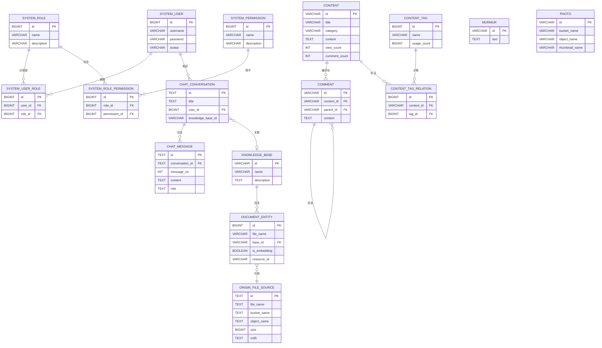

图4.7展示了系统中主要实体之间的关联关系，其中：SystemUser与SystemRole、SystemRole与SystemPermission构成RBAC权限模型的核心关系；KnowledgeBase、DocumentEntity与OriginFileSource共同支撑知识库文档管理；Content与CommentTag、Comment等实体构成博客内容发布与互动体系；ChatConversation与ChatMessage实现AI对话历史管理，并可选地关联KnowledgeBase实现基于知识库的专业问答。

#### 4.7.3 用户权限相关表

用户权限模块实现了基于RBAC（Role-Based Access Control，基于角色的访问控制）模型的权限控制体系。该模型通过引入"角色"作为用户与权限之间的中介层，解耦了用户与权限的直接绑定关系，使得权限分配更加灵活。当需要修改一类用户的权限时，仅需调整对应角色的权限集合，无需逐个修改用户。用户权限模块共包含5张表。

**表 4.7 system_user表（系统用户表）**

该表存储系统注册用户的基本信息，是整个权限体系的核心实体表。为保证用户凭证的安全性，password字段采用BCrypt不可逆哈希算法加密后存储，即使数据库泄露也无法直接还原出明文密码。avatar字段存储用户头像的访问URL。

| 字段名 | 类型 | 约束 | 说明 |
|--------|------|------|------|
| id | BIGSERIAL | PRIMARY KEY | 用户ID，自增主键 |
| username | VARCHAR(255) | NOT NULL | 用户名 |
| password | VARCHAR(255) | NOT NULL | 密码（BCrypt加密） |
| avatar | VARCHAR(500) | NULL | 用户头像URL |
| create_time | TIMESTAMP | NOT NULL DEFAULT CURRENT_TIMESTAMP | 创建时间 |
| update_time | TIMESTAMP | NOT NULL DEFAULT CURRENT_TIMESTAMP | 更新时间 |
| deleted | BOOLEAN | DEFAULT FALSE | 逻辑删除标志 |
| creator | VARCHAR(255) | NULL | 创建人 |
| updater | VARCHAR(255) | NULL | 更新人 |

**表 4.8 system_role表（系统角色表）**

该表定义系统中的角色信息。角色是一组权限的集合，典型的角色包括"超级管理员"、"普通用户"、"访客"等。通过角色机制可以实现对用户权限的批量分配和集中管理。

| 字段名 | 类型 | 约束 | 说明 |
|--------|------|------|------|
| id | BIGSERIAL | PRIMARY KEY | 角色ID，自增主键 |
| name | VARCHAR(255) | NOT NULL | 角色名 |
| description | VARCHAR(500) | NULL | 角色描述 |
| create_time | TIMESTAMP | NOT NULL DEFAULT CURRENT_TIMESTAMP | 创建时间 |
| update_time | TIMESTAMP | NOT NULL DEFAULT CURRENT_TIMESTAMP | 更新时间 |
| deleted | BOOLEAN | DEFAULT FALSE | 逻辑删除标志 |
| creator | VARCHAR(255) | NULL | 创建人 |
| updater | VARCHAR(255) | NULL | 更新人 |

**表 4.9 system_permission表（系统权限表）**

该表定义系统中的细粒度权限，权限是访问控制的最小单元。每条权限记录对应一个具体的操作动作，如content:create（创建内容）、comment:delete（删除评论）、knowledge:manage（管理知识库）等，通过字符串标识符可灵活适配不同的业务场景。

| 字段名 | 类型 | 约束 | 说明 |
|--------|------|------|------|
| id | BIGSERIAL | PRIMARY KEY | 权限ID，自增主键 |
| name | VARCHAR(255) | NOT NULL | 权限名称 |
| description | VARCHAR(500) | NULL | 权限描述 |
| create_time | TIMESTAMP | NOT NULL DEFAULT CURRENT_TIMESTAMP | 创建时间 |
| update_time | TIMESTAMP | NOT NULL DEFAULT CURRENT_TIMESTAMP | 更新时间 |
| deleted | BOOLEAN | DEFAULT FALSE | 逻辑删除标志 |
| creator | VARCHAR(255) | NULL | 创建人 |
| updater | VARCHAR(255) | NULL | 更新人 |

**表 4.10 system_user_role表（用户-角色关联表）**

该表建立用户与角色之间的多对多（M:N）关联关系。通过该关联表，一个用户可以拥有多个角色（如同时是"编辑"与"审核员"），一个角色也可以分配给多个用户。这种设计实现了用户与角色的解耦，便于权限的动态调整。

| 字段名 | 类型 | 约束 | 说明 |
|--------|------|------|------|
| id | BIGSERIAL | PRIMARY KEY | 自增主键 |
| user_id | BIGINT | NOT NULL, FOREIGN KEY → system_user(id) | 用户ID（外键） |
| role_id | BIGINT | NOT NULL, FOREIGN KEY → system_role(id) | 角色ID（外键） |
| create_time | TIMESTAMP | NOT NULL DEFAULT CURRENT_TIMESTAMP | 创建时间 |
| update_time | TIMESTAMP | NOT NULL DEFAULT CURRENT_TIMESTAMP | 更新时间 |
| deleted | BOOLEAN | DEFAULT FALSE | 逻辑删除标志 |
| creator | VARCHAR(255) | NULL | 创建人 |
| updater | VARCHAR(255) | NULL | 更新人 |

**表 4.11 system_role_permission表（角色-权限关联表）**

该表建立角色与权限之间的多对多（M:N）关联关系。一个角色可以包含多个权限，一个权限也可以被多个角色共同拥有。该表是RBAC权限模型的关键纽带，通过修改该表记录即可实现角色权限的动态调整。

| 字段名 | 类型 | 约束 | 说明 |
|--------|------|------|------|
| id | BIGSERIAL | PRIMARY KEY | 自增主键 |
| role_id | BIGINT | NOT NULL, FOREIGN KEY → system_role(id) | 角色ID（外键） |
| permission_id | BIGINT | NOT NULL, FOREIGN KEY → system_permission(id) | 权限ID（外键） |
| create_time | TIMESTAMP | NOT NULL DEFAULT CURRENT_TIMESTAMP | 创建时间 |
| update_time | TIMESTAMP | NOT NULL DEFAULT CURRENT_TIMESTAMP | 更新时间 |
| deleted | BOOLEAN | DEFAULT FALSE | 逻辑删除标志 |
| creator | VARCHAR(255) | NULL | 创建人 |
| updater | VARCHAR(255) | NULL | 更新人 |

#### 4.7.4 知识库相关表

知识库模块是本系统实现AI自我认知功能的数据基础，负责存储知识库元数据、文档实体信息以及原始文件资源的存储映射。该模块设计了三层数据模型：知识库（逻辑分组）→ 文档实体（业务数据）→ 文件资源（物理存储），实现了业务逻辑与存储细节的解耦。

**表 4.12 knowledge_base表（知识库表）**

该表存储知识库的基本信息，每个知识库代表一个独立的知识领域或主题分组，如"技术文档库"、"读书笔记库"、"项目规范库"等。用户可根据业务需要创建多个知识库，实现知识的分类管理。

| 字段名 | 类型 | 约束 | 说明 |
|--------|------|------|------|
| id | VARCHAR(32) | PRIMARY KEY | 知识库ID（UUID） |
| name | VARCHAR(100) | NOT NULL | 知识库名称 |
| description | TEXT | NULL | 知识库描述 |
| create_time | TIMESTAMP | NOT NULL DEFAULT CURRENT_TIMESTAMP | 创建时间 |
| update_time | TIMESTAMP | NOT NULL DEFAULT CURRENT_TIMESTAMP | 更新时间 |
| deleted | BOOLEAN | DEFAULT FALSE | 逻辑删除标志 |
| creator | VARCHAR(255) | NULL | 创建人 |
| updater | VARCHAR(255) | NULL | 更新人 |

**表 4.13 document_entity表（文档实体表）**

该表存储上传到知识库中的文档信息，记录文档的业务元数据与向量化处理状态。is_embedding字段作为状态标识，用于异步向量化处理流程——文档上传后该字段初始为false，后台向量化任务完成后更新为true，从而实现文档索引构建的进度追踪。

| 字段名 | 类型 | 约束 | 说明 |
|--------|------|------|------|
| id | BIGSERIAL | PRIMARY KEY | 文档ID，自增主键 |
| file_name | VARCHAR(512) | NOT NULL | 文件名 |
| path | TEXT | NOT NULL | 文件路径 |
| base_id | VARCHAR(32) | NOT NULL, FOREIGN KEY → knowledge_base(id) | 所属知识库ID |
| is_embedding | BOOLEAN | DEFAULT FALSE | 是否已完成向量化 |
| resource_id | VARCHAR(64) | NOT NULL | 关联文件资源ID |
| create_time | TIMESTAMP | NOT NULL DEFAULT CURRENT_TIMESTAMP | 创建时间 |
| update_time | TIMESTAMP | NOT NULL DEFAULT CURRENT_TIMESTAMP | 更新时间 |
| deleted | BOOLEAN | DEFAULT FALSE | 逻辑删除标志 |
| creator | VARCHAR(255) | NULL | 创建人 |
| updater | VARCHAR(255) | NULL | 更新人 |

**表 4.14 origin_file_source表（原始文件资源表）**

该表存储文件在MinIO对象存储中的物理位置与元数据信息，是业务数据与存储介质之间的映射桥梁。md5字段用于文件去重校验，避免相同文件的重复上传；images字段以JSON数组形式存储文档内嵌图片的引用列表，支持文档内图片的独立访问。

| 字段名 | 类型 | 约束 | 说明 |
|--------|------|------|------|
| id | TEXT | PRIMARY KEY | 文件唯一标识 |
| file_name | TEXT | NOT NULL | 文件名 |
| path | TEXT | NOT NULL | 文件存储路径 |
| is_image | BOOLEAN | NOT NULL | 是否为图片文件 |
| bucket_name | TEXT | NOT NULL | MinIO存储桶名称 |
| object_name | TEXT | NOT NULL | MinIO对象名称 |
| content_type | TEXT | NOT NULL | 文件MIME类型 |
| size | BIGINT | NOT NULL | 文件大小（字节） |
| md5 | TEXT | NOT NULL | 文件MD5哈希值 |
| images | TEXT | NOT NULL DEFAULT '[]' | 文档内图片列表（JSON） |
| create_time | TIMESTAMP | NOT NULL DEFAULT CURRENT_TIMESTAMP | 创建时间 |
| update_time | TIMESTAMP | NOT NULL DEFAULT CURRENT_TIMESTAMP | 更新时间 |
| deleted | BOOLEAN | DEFAULT FALSE | 逻辑删除标志 |
| creator | VARCHAR(255) | NULL | 创建人 |
| updater | VARCHAR(255) | NULL | 更新人 |

#### 4.7.5 内容管理相关表

内容管理模块实现了个人博客系统的核心功能，支持文章、视频、学习笔记、游戏等多种内容形式的发布、展示和互动。该模块采用统一的内容模型，通过category字段区分不同类型，通过content_type、video_type等扩展字段支持多态化存储，共包含5张数据表。

**表 4.15 content表（内容表）**

该表存储博客内容的核心数据，采用"单表多态"设计支持多种内容类型。view_count和comment_count字段冗余存储互动统计数据，避免每次查询时进行聚合计算，提升列表页查询性能；is_recommend字段控制首页推荐位展示；针对视频类内容，通过video_type、video_url、video_duration等字段扩展视频相关属性。

| 字段名 | 类型 | 约束 | 说明 |
|--------|------|------|------|
| id | VARCHAR(32) | PRIMARY KEY | 内容ID（UUID） |
| title | VARCHAR(255) | NOT NULL | 标题 |
| description | TEXT | NULL | 简介/描述 |
| category | VARCHAR(50) | NOT NULL | 分类（article/game/study/video） |
| cover | TEXT | NULL | 封面图片URL |
| content | TEXT | NULL | 正文内容（Markdown） |
| comment_count | INT | DEFAULT 0 | 评论数 |
| view_count | INT | DEFAULT 0 | 浏览量 |
| is_recommend | BOOLEAN | DEFAULT FALSE | 是否推荐 |
| content_type | VARCHAR(20) | DEFAULT 'article' | 内容类型 |
| video_type | VARCHAR(10) | NULL | 视频类型 |
| video_url | VARCHAR(500) | NULL | 视频URL |
| video_duration | INT | DEFAULT 0 | 视频时长（秒） |
| create_time | TIMESTAMP | NOT NULL DEFAULT CURRENT_TIMESTAMP | 创建时间 |
| update_time | TIMESTAMP | NOT NULL DEFAULT CURRENT_TIMESTAMP | 更新时间 |
| deleted | BOOLEAN | DEFAULT FALSE | 逻辑删除标志 |
| creator | VARCHAR(255) | NULL | 创建人 |
| updater | VARCHAR(255) | NULL | 更新人 |

**表 4.16 content_tag表（内容标签表）**

该表存储博客内容的标签信息。标签采用扁平化设计，便于后续扩展标签云、热门标签等功能。usage_count字段冗余记录每个标签被使用的次数，支持按使用频次对标签进行排序，优化标签推荐效果。name字段添加UNIQUE约束，保证标签名称全局唯一。

| 字段名 | 类型 | 约束 | 说明 |
|--------|------|------|------|
| id | BIGSERIAL | PRIMARY KEY | 标签ID，自增主键 |
| name | VARCHAR(50) | NOT NULL, UNIQUE | 标签名称 |
| usage_count | BIGINT | DEFAULT 0 | 标签使用次数 |
| create_time | TIMESTAMP | DEFAULT CURRENT_TIMESTAMP | 创建时间 |
| update_time | TIMESTAMP | DEFAULT CURRENT_TIMESTAMP | 更新时间 |
| deleted | BOOLEAN | DEFAULT FALSE | 逻辑删除标志 |
| creator | VARCHAR(50) | NULL | 创建人 |
| updater | VARCHAR(50) | NULL | 更新人 |

**表 4.17 content_tag_relation表（内容-标签关联表）**

该表建立内容与标签之间的多对多关联关系，一篇内容可以打多个标签，一个标签也可被多篇内容使用。表中设置了UNIQUE(content_id, tag_id)复合唯一约束防止重复关联，并通过ON DELETE CASCADE级联删除约束保证当内容或标签被删除时自动清理关联记录。

| 字段名 | 类型 | 约束 | 说明 |
|--------|------|------|------|
| id | BIGSERIAL | PRIMARY KEY | 自增主键 |
| content_id | VARCHAR(50) | NOT NULL, FOREIGN KEY → content(id) ON DELETE CASCADE | 内容ID |
| tag_id | BIGINT | NOT NULL, FOREIGN KEY → content_tag(id) ON DELETE CASCADE | 标签ID |
| create_time | TIMESTAMP | DEFAULT CURRENT_TIMESTAMP | 创建时间 |

**表 4.18 comment表（评论表）**

该表存储用户对内容的评论数据，通过parent_id字段实现嵌套回复的无限层级结构——顶级评论的parent_id为NULL，回复评论的parent_id指向被回复的评论ID。评论数据会定期同步到知识库系统中进行向量化处理，从而丰富AI问答的知识维度。

| 字段名 | 类型 | 约束 | 说明 |
|--------|------|------|------|
| id | VARCHAR(32) | PRIMARY KEY | 评论ID（UUID） |
| content_id | VARCHAR(32) | NOT NULL | 关联内容ID |
| content_type | VARCHAR(50) | NOT NULL | 内容类型 |
| avatar | TEXT | NULL | 评论者头像URL |
| author | VARCHAR(255) | NULL | 评论者昵称 |
| user_id | VARCHAR(255) | NULL | 评论者用户ID |
| content | TEXT | NOT NULL | 评论内容 |
| parent_id | VARCHAR(32) | NULL | 父评论ID（回复用，顶级评论为NULL） |
| is_recommend | BOOLEAN | DEFAULT FALSE | 是否推荐 |
| create_time | TIMESTAMP | NOT NULL DEFAULT CURRENT_TIMESTAMP | 创建时间 |
| update_time | TIMESTAMP | NOT NULL DEFAULT CURRENT_TIMESTAMP | 更新时间 |
| deleted | BOOLEAN | DEFAULT FALSE | 逻辑删除标志 |
| creator | VARCHAR(255) | NULL | 创建人 |
| updater | VARCHAR(255) | NULL | 更新人 |

**表 4.19 murmur表（碎碎念表）**

该表存储用户发布的短内容动态，功能定位类似于微博或朋友圈的轻量级发布功能，用于记录日常感悟、灵感片段等短文本内容。相比content表，murmur表结构精简、字段较少，专注于文字流式发布场景。

| 字段名 | 类型 | 约束 | 说明 |
|--------|------|------|------|
| id | VARCHAR(32) | PRIMARY KEY | 碎碎念ID（UUID） |
| text | TEXT | NOT NULL | 碎碎念内容 |
| create_time | TIMESTAMP | NOT NULL DEFAULT CURRENT_TIMESTAMP | 创建时间 |
| update_time | TIMESTAMP | NOT NULL DEFAULT CURRENT_TIMESTAMP | 更新时间 |
| deleted | BOOLEAN | DEFAULT FALSE | 逻辑删除标志 |
| creator | VARCHAR(255) | NULL | 创建人 |
| updater | VARCHAR(255) | NULL | 更新人 |

**表 4.20 photo表（照片表）**

该表存储照片资源的元数据，采用原图与缩略图分离存储的设计。object_name字段记录原图的存储路径，thumbnail_name字段记录压缩后的缩略图路径。列表展示时加载缩略图以减少带宽消耗、提升页面加载速度，用户点击查看详情时再加载原图。

| 字段名 | 类型 | 约束 | 说明 |
|--------|------|------|------|
| id | VARCHAR(32) | PRIMARY KEY | 照片ID（UUID） |
| bucket_name | VARCHAR(100) | NOT NULL | MinIO存储桶名称 |
| object_name | VARCHAR(500) | NOT NULL | MinIO对象名称（原图） |
| thumbnail_name | VARCHAR(500) | NULL | 缩略图对象名称 |
| description | TEXT | NULL | 照片描述 |
| create_time | TIMESTAMP | NOT NULL DEFAULT CURRENT_TIMESTAMP | 创建时间 |
| update_time | TIMESTAMP | NOT NULL DEFAULT CURRENT_TIMESTAMP | 更新时间 |
| deleted | BOOLEAN | DEFAULT FALSE | 逻辑删除标志 |
| creator | VARCHAR(255) | NULL | 创建人 |
| updater | VARCHAR(255) | NULL | 更新人 |

#### 4.7.6 AI对话相关表

AI对话模块负责存储用户与AI之间的会话记录及消息历史，支持多轮对话上下文管理、会话持久化和基于知识库的专业问答。该模块采用"会话-消息"两级数据模型，既保证了对话结构的清晰，又便于消息的分页加载与历史查询。

**表 4.21 chat_conversation表（对话会话表）**

该表存储AI对话会话的元数据，一次完整的对话交互被抽象为一个会话实体。knowledge_base_id字段为可选字段，当用户选择基于特定知识库进行提问时，该字段记录所关联的知识库ID，从而实现RAG（Retrieval-Augmented Generation，检索增强生成）模式下的专业问答。

| 字段名 | 类型 | 约束 | 说明 |
|--------|------|------|------|
| id | TEXT | PRIMARY KEY | 会话ID（UUID） |
| title | TEXT | NOT NULL | 会话标题 |
| user_id | BIGINT | NOT NULL, FOREIGN KEY → system_user(id) | 发起人用户ID |
| knowledge_base_id | VARCHAR(255) | NULL | 关联知识库ID |
| create_time | TIMESTAMP | NOT NULL DEFAULT CURRENT_TIMESTAMP | 创建时间 |
| update_time | TIMESTAMP | NOT NULL DEFAULT CURRENT_TIMESTAMP | 更新时间 |
| deleted | BOOLEAN | DEFAULT FALSE | 逻辑删除标志 |
| creator | VARCHAR(255) | NULL | 创建人 |
| updater | VARCHAR(255) | NULL | 更新人 |

**表 4.22 chat_message表（聊天消息表）**

该表存储会话中的具体消息内容，通过message_no字段维护会话内消息的时序关系，保证消息展示顺序的稳定性。role字段区分消息发送方：user表示用户消息，assistant表示AI回复，system表示系统提示；has_media与resource_ids字段共同支持多模态消息（如携带图片的提问），resource_ids以JSON数组形式存储附件资源的ID列表。

| 字段名 | 类型 | 约束 | 说明 |
|--------|------|------|------|
| id | TEXT | PRIMARY KEY | 消息ID（UUID） |
| conversation_id | TEXT | NOT NULL | 所属会话ID |
| message_no | INT | NOT NULL | 消息序号 |
| has_media | BOOLEAN | NOT NULL | 是否携带附件 |
| content | TEXT | NOT NULL | 消息内容 |
| role | TEXT | NOT NULL | 角色（user/assistant） |
| resource_ids | TEXT | NOT NULL DEFAULT '[]' | 附件资源ID列表（JSON） |
| is_clean | BOOLEAN | DEFAULT FALSE | 是否已清理 |
| create_time | TIMESTAMP | NOT NULL DEFAULT CURRENT_TIMESTAMP | 创建时间 |
| update_time | TIMESTAMP | NOT NULL DEFAULT CURRENT_TIMESTAMP | 更新时间 |
| deleted | BOOLEAN | DEFAULT FALSE | 逻辑删除标志 |
| creator | VARCHAR(255) | NULL | 创建人 |
| updater | VARCHAR(255) | NULL | 更新人 |

#### 4.7.7 索引与触发器设计

为提升数据库查询性能、保证数据一致性，本系统为核心业务表建立了如下索引和触发器机制：

（1）**索引设计**：针对高频查询场景建立B-Tree索引，覆盖外键字段和常用过滤字段。

**表 4.23 核心索引设计**

| 索引名 | 所在表 | 索引字段 | 索引用途 |
|--------|--------|----------|----------|
| idx_chat_message_conversation_id | chat_message | conversation_id | 加速会话消息查询 |
| idx_chat_conversation_user_id | chat_conversation | user_id | 加速用户会话列表查询 |
| idx_document_entity_base_id | document_entity | base_id | 加速知识库文档查询 |
| idx_origin_file_source_md5 | origin_file_source | md5 | 文件去重查询 |
| idx_content_category | content | category | 分类筛选查询 |
| idx_content_is_recommend | content | is_recommend | 推荐内容查询 |
| idx_murmur_create_time | murmur | create_time DESC | 按时间倒序查询 |
| idx_comment_content | comment | (content_id, content_type) | 评论关联查询 |
| idx_comment_parent | comment | parent_id | 嵌套评论查询 |
| idx_photo_create_time | photo | create_time DESC | 照片列表查询 |
| idx_content_tag_name | content_tag | name | 标签名检索 |
| idx_content_tag_usage_count | content_tag | usage_count DESC | 热门标签排序 |

（2）**触发器设计**：通过PostgreSQL的触发器机制实现update_time字段的自动更新，避免应用层代码重复维护时间字段。系统定义了统一的触发函数update_updated_at_column()，并为每张业务表绑定该触发器，在UPDATE操作前自动将update_time更新为当前时间戳。

```sql
-- 更新时间自动触发函数
CREATE OR REPLACE FUNCTION update_updated_at_column()
    RETURNS TRIGGER AS $$
BEGIN
    NEW.update_time = now();
    RETURN NEW;
END;
$$ LANGUAGE 'plpgsql';

-- 为业务表绑定触发器（以system_user为例）
CREATE TRIGGER update_system_user_updated_at
    BEFORE UPDATE ON system_user
    FOR EACH ROW EXECUTE FUNCTION update_updated_at_column();
```

通过上述数据库设计，系统实现了数据的规范化存储、高效的查询访问以及完整的数据审计能力，为上层业务逻辑提供了稳定可靠的数据支撑。

---

